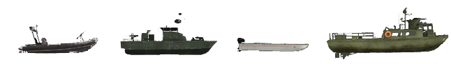
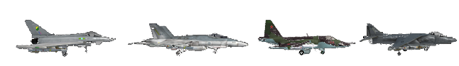

# الأساسيات

الأمر الأهم هو **الانضمام إلى فرقة**. بعض الخوادم حتى تفرض ذلك عن طريق طرد اللاعبين الفرديين بعد فترة تحذير. اللعبة أكثر متعة عند اللعب في فرقة تعمل بشكل جيد. إذا كنت بحاجة إلى أي مساعدة، فقط **اسأل اللاعبين في فرقتك** ما يجب القيام به. إذا كان ذلك ممكنًا، استخدم Mumble. إنه مستخدم بشكل شائع في PR. اللعب في PR:BF2 بدون ميكروفون لن يمنحك التجربة الكاملة لذلك فإنه استثمار حكيم. إذا لم يجيب أحد، جرب الانضمام إلى فرقة أخرى أو استخدم الدردشة العامة. هناك العديد من أعضاء المجتمع المساعدين الذين يرحبون باللاعبين الجدد ويقدمون لهم المساعدة.

نتوقع منك أن تمتلك بعض الفهم الأساسي لـ BF2 عندما يتعلق الأمر بالتنقل في القوائم داخل اللعبة مثل لوحة النتائج والخريطة واختيار العتاد. للتعرف على واجهة PR يمكنك بدء مباراة غير متصلة بالإنترنت عن طريق النقر على التعاوني أو اللاعبين المتعددين، ثم إنشاء محلي، انقر على إضافة الخريطة ثم نفذ.

## _اختيار العتاد والتوليد_ {#اختيار-العتاد-والتوليد}

* عندما تبدأ اللعب، يُوصى بأن تولد فقط كـ جندي مع نظرة من اختيارك. بهذه الطريقة يمكنك تعلم الأساسيات الأساسية للعب.
* بعد تعلم الأساسيات الخاصة بالجنود يمكنك طلب من قائد الفرقة تعيين عتاد متخصص عندما تشعر بأنك جاهز للمهمة. إذا كنت ترغب في تجربة معدات جديدة أو مركبة، يمكنك القيام بذلك بسهولة في وضع التعاون دون إزعاج أعضاء الفرقة أو تعريض أصول فريقك للخطر.
* العتاد المتخصص والأكثر صعوبة في التشغيل عادة ما يكون محدودًا ويمكن الحصول عليه فقط إذا تم تلبية شروط معينة ضمن فرقة. هذه العتاد المحجوزة محدودة للغاية للفريق ويجب عليك دائمًا السؤال قبل طلب واحدة.
* يمكن طلب العتاد من القائمة الرئيسية للتوليد (الافتراضي: **Caps Lock**), صندوق إمداد \([انظر اللوجستيات](the_basics.md#logistics)\) أو الجزء الخلفي من مركبة النقل العسكري / المدرعة. لكي تكون لديك القدرة على طلب عتاد من صندوق إمداد أو مركبة، يجب أن تكون جزءًا من فرقة.

في PR:BF2 لا يمكنك التوليد في كل نقطة تحكم يسيطر عليها فريقك. نقاط التوليد المتاحة في PR:BF2 هي:

* **نقطة التوليد الفرعية لفرقتك (RP)** هي دائرة خضراء تحيط بنقطة توليد مع رقم فرقتك المجاور لها. يعتمد طول عمرها على موقع نقطة التوليد الفرعية الخاصة بفرقتك بالنسبة لـ FOB للفريق. ملاحظة: إذا تولدت على نقطة توليد فرقة أخرى، ستولد تلقائيًا على نقطة توليد فرقتك الخاصة، أو أي FOB قريب. إذا لم تكن متاحة ستنقل إلى القاعدة الرئيسية لفريقك. إذا تم الاستيلاء عليها من قبل العدو، ستختفي نقطة توليد فرقتك الفرعية. نقاط التوليد الفرعية غير متاحة لكل الفصائل. \([انظر الهياكل القابلة للنشر](the_squad_leader.md#deployable-structures)\)


نقطة تجمع


* **نقاط تجمع الفريق الخاصة بالخريطة**. هذه النقاط تنتهي عادة بعد 5 دقائق من بدء الجولة ويمكن استخدامها من قبل الفريق بأكمله. كما أنها تسمح فقط بظهور حد أقصى 12 شخصًا عليها حتى تختفي.
* **نقطة التجمع الخاصة بالقائد**. يمكن وضع هذه النقطة فقط من قبل القائد، بشرط وجود قائد فرقة و4 أفراد من الفرقة بالقرب من القائد. على الخريطة ستظهر هذه النقطة بجانبها حرف "C".
* **قاعدة تشغيلية أمامية (FOB) أو مخابئ** يمكن استخدامها من قبل الفريق بأكمله للظهور فيها، ولكن يجب بناؤها قبل أن تصبح تشغيلية. على الخريطة ستظهر كنقطة ظهور برمادي أخضر. تصبح تشغيلية بعد مرور 90 ثانية من بنائها. تصبح غير قابلة للظهور لمدة 30 ثانية إذا كان هناك عدو واحد على بعد 10 متر، أو 2 أعداء على بعد 50 متر، أو 4 أعداء على بعد 100 متر، أو 8 أعداء على بعد 150 متر. [\(انظر الهياكل القابلة للنشر\)](the_squad_leader.md#deployable-structures)
* في وضع اللعب Insurgency، يمكن لفريق المتمردين الدفاعي أن يظهر في **مخازن الأسلحة** التي لم يتم الكشف عنها للعدو، ويُطلق عليها اسم المخزن المجهول. يتم تعطيل هذا الظهور أيضًا إذا اقترب الأعداء كثيرًا، على غرار ما يحدث مع الـ FOB.


نقطة التجمع، مخبأ ومخزن للأسلحة.


* **مقر فريقك، القاعدة الرئيسية أو النقطة الدائمة.** هذه هي النقطة الوحيدة التي يمكن الوصول إليها دائمًا.


مركبة قيادة مدرعة (ACV) توجد فقط في القواعد الرئيسية.


* بعض الخرائط تتضمن **نقاط إنزال بالمظلة** حيث يتم تحاكي الهجوم الجوي. سيتم تصوير هذه النقاط على الخريطة الصغيرة. اختر واحدة وستظهر بمظلة تنفتح تلقائيًا.
## واجهة اللعبة \(HUD\)
* في واجهة اللعبة في PR:BF2، يتم إخطار اللاعبين بواسطة **رسائل محددة لكل لاعب** التي يمكن رؤيتها فقط من قبل ذلك اللاعب. يتم استخدامها لإعطاء اللاعبين تغذية راجعة حول أحداث اللعبة المختلفة على سبيل المثال:
  * السبب في عدم منح اللاعب العدة التي طلبها.
  * السبب في عدم إمكانية بناء الأصل القابل للنشر الذي طلبه اللاعب.
  * أن اللاعب يجب أن يخرج من السيارة أو المقعد الحالي لتجنب العقوبة.
* يستخدم PR أيضًا **إشعارات القيادة العليا** التي تُعرض بخط برتقالي كبير في أعلى الشاشة اليسرى. تقدم هذه الإشعارات تحديثات حول الأهداف الحالية وتقدم المهمة ورسائل أخرى أساسية.
* ستظهر الرسائل المباشرة من مسؤولي الخادم وبعض أنواع إشعارات اللعبة بنص برتقالي بالقرب من مركز الشاشة. بعض هذه الرسائل إعلامية فقط بينما البعض الآخر، خاصة رسائل مسؤولي الخادم، قد تتطلب انتباهك.
* إذا فاتك رسالة أو إعلان، مثل نتيجة التصويت على الخريطة، يمكنك عرضها مرة أخرى عن طريق الاستمرار في الضغط على زر Tab، ثم النقر بزر الماوس الأيمن مرة واحدة لتنشيط المؤشر الخاص بك والنقر بزر الماوس الأيسر على علامة التبويب **الإشعارات**.
* تمت إزالة **شعارات الاستهداف** من الشاشة. إذا كنت ترغب في إطلاق النار بدقة، فيجب عليك الضغط على مفتاح الإطلاق البديل لتوجيه نظرك نحو نقاط الهدف للسلاح، أو استخدام BUIS للقتال في المسافات القريبة \(انظر [فصل الأسلحة](weapons_and_equipment.md#buis)\).
* **تمت إزالة معظم الرموز ثلاثية الأبعاد** لجميع اللاعبين. من الضروري تحديد أهدافك قبل التورط لتجنب إطلاق النار على الأصدقاء. يساعدك تعلم التمييز بين أنماط الكامو، والأعلام، وشكل ملامح جنود الفصائل في تحديد العدو بشكل أسرع. على سبيل المثال، للعثور على قائد الفرقة، ابحث عن هوائي راديو يمتد لأعلى من حقيبته.
* **لا يوجد شريط حالة الصحة** الذي يشير إلى حالتك الحيوية. \([انظر إدارة الصحة](the_basics.md#health-management)\)
* **عداد الذخيرة** يعرض فقط وضع إطلاق السلاح وعدد المجلات المتبقية.
* لتقدير **عدد الطلقات المتبقية** في المجلة يمكنك فتح الوردة التواصلية \(استمرار الضغط: **Q**\) ورؤية مؤشر بصري على كمية الذخيرة المتبقية.


مؤشر الذخيرة.


* **الطبيب** يمكنه رؤية مدى اكتمال عملية شفاء الجندي من خلال واجهة المستخدم الرقمية التي تظهر فوق البوصلة. يمكن للجنود المشاة مشاهدة نفس الطريقة لمعرفة متى سينتهي الجهاز القابل للنشر من حفر الأرض.


شريط مؤشر الشفاء / البناء.


* لا توجد **رسائل قتل** \(النيران الصديقة استثناء\). حتى الجدول الزمني لن يظهر من هو على قيد الحياة أو ميت في فريق العدو. إذا كنت بحاجة لمعرفة ما إذا كان شخص ما ميتًا، يجب عليك البحث عن جثته.
* يستخدم الطائرات وبعض سائقي المركبات الدبابات فقط **خريطة صغيرة** دائمة على الواجهة. يتوفر تراكب الخريطة الكامل للجميع.
* يمكن رؤية **الخريطة والطبقة الحالية** في أعلى الشاشة عند فتح الخريطة باستخدام قائمة الفرق/الطقم.
* باستخدام السهم الصغير \(على يسار المؤقت\) ستظهر لك **معلومات الأصول الحالية للخريطة** لجميع المركبات الموجودة على الخريطة بما في ذلك أوقات الإعادة للمركبات الصديقة وما إذا كانت تنتظر بتأخير أو تعيد الظهور بعد تدميرها. القصف الجوي خارج الخريطة أو المدفعية، المعروفة أيضًا باسم هجمات المنطقة، عادة ما تكون محدودة إلى 3 أو 4 استخدامات، ويمكن استخدامها فقط بعد فترات انتظار طويلة نسبيًا.


معلومات الأصول الحالية على الخريطة.


* **يمكن رؤية التذاكر المتبقية** لفريقك والوقت المتبقي فقط من شاشة الفريق. لا يتم عرض تذاكر العدو.
* **القمع** يحدث عندما تكون تحت نيران مدفعية قريبة أو أسلحة ثقيلة أو انفجارات قريبة. ستصبح الشاشة غير واضحة، كما لو كانت تهتز. يحاكي هذا التأثير القدرة المخفضة على الرد بفعالية بينما يتم قمعك من قبل العدو.


العرض العادي للعبة (اليسار) وتأثير القمع في العمل (اليمين).

* يقع على الجانب الأيسر السفلي من الشاشة شريط للقدرة. ستقلل الركض والقفز من القدرة المتاحة، وعدم الركض أو القفز سيعيد تعبئتها ببطء. عندما يتم تقليل القدرة إلى 50٪ أو أقل، كما هو موضح بالوميض، لن يكون الركض ممكنًا بعد، ولكن القفز لا يزال ممكنًا.
* عندما يكون اللاعب **ميتًا** (يشار إليه عادة بالموت الحقيقي)، فلن يكون قابلًا للإحياء وسيتم عرض شاشة سوداء مع رسالة مناسبة بدلاً من رؤية المحيط.
* ستتدهور أداة القتال الخاصة بك وتصبح غير دقيقة للإطلاق بناءً على كمية الحركة التي تقوم بها. عند التصويب بنظرة على الأهداف، سيظهر مؤشر **الانحراف** فوق بوصلتك، يُظهر مستوى الانحراف الحالي لأداة القتال الخاصة بك. كلما زادت عرض المؤشر، زادت الانتشار؛ إذا اندمجت النقطتان في نقطة واحدة، فقد وصلت أداة القتال الخاصة بك إلى انحراف منخفض، ولكن قد يستغرق الأمر لحظة أو لحظتين أخريين لكي تصل الأداة إلى دقتها القصوى.
* **تمت إزالة نظام الكشف التلقائي على الخريطة** من الجنود العاديين. يمكن للمركبات الجوية ما زالت يمكن رؤيتها من داخل مركبة.
* يمكن للضباط إرسال تقرير **عن الاتصال** إلى القائد أو استخدام راديوهاتهم لوضع علامة يدويًا على خريطة الفريق. يمكن للجنود العاديين فقط أن يصرخوا تحذيرًا عامًا عند رؤية وحدات العدو.
* **يحتوي راديو Commo-rose (الافتراضي: Q & T)** على عناصر تحتوي على وظيفتين. النقر الأيسر **"إعادة تحميل / وقف إطلاق النار"** يخبر الأشخاص من حولك أنك تقوم بتغيير الخراطيش، بينما يخبرهم النقر الأيمن بالتوقف عن الإطلاق. ينطبق نفس المبدأ على **"انطلق، انطلق، انطلق / انسحب"** وغيرها من عناصر القائمة.


التواصل السريع عند الضغط على Q.

* يمكنك **توجيه نفسك** على الخريطة باستخدام عنصر الاتجاه الذي ستجده حول رمز اللاعب الخاص بك.
* عندما تكون مجهزًا بأسلحة أو معدات معينة، يتم استبدال القائمة الرئيسية للاتصال اللاسلكي بقائمة سياقية صغيرة. عند حملك لـ "field dressing" أو حقيبة الإسعاف، يمكنك استخدام أمر "FIRST AID" لإبلاغ اللاعبين القريبين بأنك ترغب في علاجهم. تستخدم العديد من القطع وبعض الأسلحة قوائم سياقية.

## _إدارة الصحة_ {#إدارة-الصحة}

الأسلحة في Project Reality قاتلة للغاية ومسألة وقت حتى تتعرض لإصابة وتبدأ في النزيف. على الرغم من أن HUD في PR لا يحتوي على شريط صحة، إلا أنه بمجرد أن تنخفض صحتك دون 75٪، ستظهر إشارات بصرية لتحذيرك مثل شاشة تظلم بانتظام مع تأثير رؤية النفق. عندما تكون الصحة أقل من 25٪، ستسمع سعالًا وزفيرًا ثقيلًا، عند 10 نقاط صحة ستفقد قدرتك على القتال ولا يمكنك استعادتها إلا إذا عالجت نفسك فوق تلك الـ 10 نقاط. أثناء النزيف، سيزداد تأثير تظلم الشاشة ورؤية النفق، مما يقيد فعاليتك في المعركة أكثر فأكثر.

### العلاج

بمجرد دخولك في حالة النزيف، ستستمر في فقدان الصحة مع مرور الوقت حتى تفقد الوعي في النهاية. لتجنب ذلك، لديك طريقتان لعلاج نفسك. تحتوي معظم الحقائب تقريبًا على "field dressing" التي يتم اختيارها عن طريق الضغط على المفتاح المناسب أو التنقل من خلال تحديد السلاح الخاص بك. الضغط على زر النار يرميها على الأرض. خلال ثانية أو ثانيتين، ستختفي "field dressing" وسيستعيد اللاعب الذي يقف بجواره 25٪ من إجمالي صحته. التصحيح نفسه لا يوقف النزيف. إذا كانت صحتك، بعد تطبيق الرقعة، لا تزال أقل من 75٪، ستستمر في النزيف ولم تشتري وقتًا لنفسك فقط، لذا يجب عليك تطبيق المزيد من "field dressings" إذا كانت متاحة، والتنقل بين جثث الأعداء إذا لزم الأمر.

تمنح معظم الحقائب فقط "field dressing" واحدة للاستخدام الطارئ، يعتمد اللاعبون بشكل كبير على الأطباء النفسيين في فرقهم أو فرقهم للعودة إلى الصحة الكاملة. الأدوار الطبية والمتعاونة هي الوحيدة التي تمنحها علبة إسعاف أولي لعلاج الأصدقاء دون الحاجة إلى "field dressings". عند الإصابة، استخدم إما mumble أو commo rose ("Q") خيار الاتصال "Medic" لجذب انتباه طبيبك. ومع ذلك، على عكس BF2، لا يمكن للطبيب إلقاء علبة الإسعاف الأولي على الأرض بل يجب أن يمسكها بيديه، ويكون على مسافة تلامس من اللاعب المصاب ثم يضغط على زر الماوس الأيسر بينما ينظر نحوهم. سيشير صوت يحاكي تمزيق الضمادات إلى أن الإسعاف الأولي يتم تطبيقه. يستغرق الشفاء الكامل حوالي 15 ثانية، لذا تأكد من القيام بذلك في مكان آمن.


تضميد الجروح، مجموعة الإسعافات الأولية والإيبين.


### إحياء

إذا كنت غير قادر على الشفاء في الوقت المناسب، ستفقد الوعي وستظهر على الشاشة رسالة تقول إنك تعاني من جرح حرج. هذا لا يعني أنك ميت! عندما تصبح في حالة جرح حرج، يمكن للطبيب النقلي إحيائك خلال 5 دقائق، مما يوفر لفريقك تذاكر قيمة. يمكنك استخدام Mumble لتنسيق الطبيب النقلي إلى موقعك عن طريق استخدام القناة المحلية (H) أو شبكة الراديو للفرق (Numpad 0). يمكنك أيضًا النقر على زر استدعاء الطبيب النقلي لتظهر مؤقتًا على الخريطة لكل طبيب في الفريق.

لإحيائك، سيختار الطبيب النقلي الإبرة النقلية من قائمة أسلحته (الافتراضي: 5) وبالإبرة في يده، سيقوم بحقن وإعطاء جرعة الأدرينالين إلى منطقة الصدر المركزية للاعب الذي فقد الوعي عن طريق النقر والاستمرار في الضغط على زر الماوس الأيسر. سيستعيد اللاعب الوعي بعد ذلك ولكنه سيكون فقط بنسبة 10% من الصحة وسيحتاج لاستمرار الشفاء. يجب على الطبيب واللاعب الذي تم إحياؤه مؤخرًا العثور على منطقة آمنة ومواصلة عملية الشفاء هناك.

إذا كان اللاعب عالقًا على أرض غير مستوية أو في وضع سيء للإحياء، فمن الضروري سحب الجسم المصاب إلى وضع أفضل أولاً. لسحب الجسم كطبيب، يجب أن تكون في وضع الانحناء والبقاء فيه. بعد ذلك يمكنك استخدام فتحة السلاح للسحب (الافتراضي: 2) لبدء السحب. يمكنك السحب في جميع الاتجاهات بما في ذلك الخلف.

{{ "Video Tutorial - Reviving" | youtube("auBgiI8IxWE") }}

### الموت

أحيانًا لن يكون اللاعبون قابلين للإحياء، مثل عندما يتم قتل لاعب في مركبة. إذا تم إحياؤك مؤخرًا وأصبحت مصابًا بجروح حرجة مرة أخرى في غضون 2 دقيقة، فلن تكون قابلًا للإحياء في المرة الثانية. إذا كنت مصابًا ولم يتم إحياؤك في غضون 5 دقائق، فسوف تموت أيضًا. إذا لم يكن هناك فرصة للإحياء، انقر على **الاستسلام** على شاشة الظهور. الآن ستظهر الشاشة أنك ميت ويمكنك الاستعداد للظهور من جديد. الوقت الذي قضيته في الانتظار قبل النقر على الاستسلام يحتسب ضمن وقت الظهور الإجمالي الخاص بك.

### الظهور من جديد

وقت ظهور اللاعب على الأقل 45 ثانية وعلى الأكثر 60 ثانية بالإضافة إلى العقوبات المؤقتة. يتم خصم الوقت الذي قضاه في انتظار الطبيب من ذلك الوقت. بمجرد موت اللاعب، يجب عليه الانتظار لمدة 5 ثوانٍ على الأقل قبل الظهور من جديد. تؤثر هذه الإجراءات على وقت الظهور من جديد:

* موت اللاعب: **+3 ثوانٍ**
* الاستيلاء على نقطة التحكم أو تدمير الهدف: **-3 ثوانٍ**
* القيام بإجراء دفاعي: **-1 ثانية**
* بناء نقطة تجمع للفريق الأمامية: **-10 ثوانٍ**

يتم إضافة عقوبة مؤقتة لوقت الظهور تؤثر فقط على المرة التالية التي تموت فيها \(تصل إلى 5 دقائق\) من خلال هذه الإجراءات:

* قتل الفريق: **15 ثانية لكل قتل في الفريق**
* الانتحار: **15 ثانية**
* اعتقال مدني: **90 ثانية**
* قتل مدني ينتهك قواعد الاشتباك: **120 ثانية لكل مدني**
* تدمير مخزن الأسلحة الوديعة: **300 ثانية**

لتحديد نقطة الظهور، افتح خريطة الظهور \(الافتراضي: **Enter**\) وحدد موقعًا مناسبًا مميزًا بنقطة بيضاء. بمجرد أن تكون راضيًا عن موقع الظهور ذلك، يجب عليك النقر على زر **الظهور** في الزاوية السفلية اليمنى من شاشة الخريطة للظهور من جديد في اللعبة.

## _اللوجستيات_ {#logistics}

سواء كنت تواجه نقصًا في الذخيرة وتحتاج إلى إعادة التسليح، أو ترغب في حصول على حقيبة جديدة أو ببساطة ترغب في بناء الأجهزة القابلة للنشر: تبقي اللوجستيات فريقك على قيد الحياة.

### الذخيرة {#ammunition}

لتكون قادرًا على إعادة التسليح لنفسك، ستحتاج إلى الاقتراب من إحدى عدة مصادر للذخيرة، والتي ستملأ سلاحك تلقائيًا بعد ذلك. هذه المصادر هي:

* **حقائب الذخيرة** - يمكن العثور عليها في حقائب الجندي المسلح، والمقاتل، والمحارب، وبعض أطقم المتمردين، ويجب رميها \(انقر بالزر الأيسر\) على الأرض، لكي يتمكن أنت أو جنود آخرون من إعادة التسليح، أو على الأجهزة القابلة للنشر \(القاطرة، والمدافع المضادة للطائرات، والمدافع\) لإعادة تسليحها.
* **صناديق الذخيرة** - تُسقط من قبل مركبات النقل الخفيفة، ومركبات النقل المصفحة، ومركبات النقل العسكرية المصفحة.
* **صناديق الإمداد الخفيفة/الثقيلة** - تُسقط أساسًا من قبل شاحنات النقل أو الإمداد \(المعروفة أيضًا باسم اللوجيستيات\) والمروحيات النقل. لمزيد من المعلومات انظر [صناديق الإمداد](the_basics.md#crates).
* **مخابئ الأسلحة** - متاحة فقط للمتمردين.
* **مستودع المركبات** - موجود في جميع القواعد الرئيسية، ويقوم أيضًا بشفاءك.


حقيبة الذخيرة، صندوق ذخيرة قوات التحالف، صندوق ذخيرة الثوار، مخزن الأسلحة ومستودع المركبات.


كن على علم أن جميع مصادر الذخيرة محدودة باستثناء **مخازن الأسلحة** و**مستودع المركبات**. في النهاية، ستنفد هذه المصادر وتختفي. من الممكن حتى أن تنفد مصادر الذخيرة قبل أن تعيد تسليح نفسك تمامًا. تستخدم **حقائب الذخيرة**، **صناديق الذخيرة** و**صناديق الإمداد** نقاط الإمداد لتحديد مدى استخدامها. يمكنك معرفة النقاط المتبقية لصناديق الإمداد وصناديق الذخيرة عن طريق النظر إليها لثانية. ستظهر بجوار البوصلة. تتطلب الأسلحة المختلفة المتاحة في PR كميات مختلفة من نقاط الإمداد لإعادة التزويد. العناصر المنفعية مثل خطاف الحبال، الألغام الإشارية والضمادات الطبية تكلف أقل لإعادة التزويد لكل استخدام من الذخيرة المتفجرة مثل الصواريخ/الصواريخ المضادة للدبابات، القنابل العنقودية والألغام. انظر الجداول أدناه لتكلفة إعادة التزويد لفئة ونوع السلاح المقابل:

<b>الأسلحة النارية</b>

| **النوع** | **تكلفة نقاط التوريد** |
| --- | --- |
| **مسدسات سعة منخفضة** | 15 |
| **مسدسات سعة عالية** | 30 |
| **PDW** | 30 |
| **رشاشات SMG** | 45 |
| **بندقية رئيسية** | 50 |
| **بندقية تخريق** | 25 |
| **بندقية** | 60 |
| **قناص** | 40 |
| **رشاش خفيف LMG** | 150 |
| **رشاش ثقيل GPMG** | 200 |

<b>قاذف قنابل/قنابل بندقية</b>

| **النوع** | **تكلفة نقاط التوريد** |
| --- | --- |
| **مضاد للدبابات x1** | 70 |
| **مضاد للدبابات x2** | 140 |
| **إشعال** | 60 |
| **تفجير سعة منخفضة** | 80 |
| **تفجير سعة عالية** | 120 |
| **دخان** | 60 |

<b>العناصر والمرافق</b>

| **النوع** | **تكلفة نقاط التوريد** |
| --- | --- |
| **صندوق الذخيرة** | 200 |
| **C4 سعة منخفضة** | 45 |
| **C4 سعة عالية** | 75 |
| **الفخ المضيء** | 20 |
| **خطاف التسلق** | 40 |
| **الإبرة الإنعاشية** | 60 |
| **تضميد الميدان x1** | 30 |
| **تضميد الميدان x3** | 75 |
| **تضميد الميدان x6** | 120 |
| **تضميد الميدان x12** | 180 |

<b>الذخيرة الثقيلة والذخائر</b>

| **النوع** | **تكلفة نقاط الإمداد** |
| --- | --- |
| **قنبلة تفجيرية x1** | 60 |
| **قنبلة تفجيرية x2** | 120 |
| **قنبلة تفجيرية x4** | 240 |
| **قنبلة دخان سعة منخفضة** | 40 |
| **قنبلة دخان سعة عالية** | 60 |
| **قنبلة دخان إشارة** | 30 |
| **منجنيق مضاد للأفراد x2** | 140 |
| **منجنيق مضاد للأفراد x3** | 210 |
| **منجنيق تقليدي** | 420 |
| **منجنيق متمردين** | 160 |
| **IED خفيفة** | 60 |
| **IED ثقيلة** | 80 |
| **صاروخ مضاد للطائرات x1** | 100 |
| **صاروخ مضاد للطائرات x2** | 170 |
| **صاروخ مضاد للدبابات الخفيف x1** | 70 |
| **صاروخ مضاد للدبابات الخفيف x2** | 140 |
| **صاروخ مضاد للدبابات الخفيف x3** | 210 |
| **صاروخ مضاد للدبابات الخفيف x4** | 280 |
| **صاروخ مضاد للدبابات المتوسط x1** | 80 |
| **صاروخ مضاد للدبابات المتوسط x2** | 160 |
| **صاروخ مضاد للدبابات المتوسط x3** | 240 |
| **صاروخ مضاد للدبابات الثقيل x1** | 90 |
| **صاروخ مضاد للدبابات الثقيل x2** | 180 |
| **صاروخ مضاد للدبابات الموجه** | 120 |

يرجى ملاحظة أن نظام إعادة التزويد على الخادم المحلي لن يعمل كما هو موضح. سيتطلب كل فتحة سلاح 100 نقطة إمداد لإعادة التعبئة بغض النظر عن نوع العنصر.

طلب عدة يكلف 250 نقطة إمداد. يرجى ملاحظة أن إعادة تعبئة حقيبة ذخيرة في صندوق ذخيرة خفيف أو ثقيل، على سبيل المثال، ستكلف 200 نقطة.

كمية نقاط الإمداد لمصادر الإمداد هي:

* **حقائب الذخيرة :** 205 \(سيتم احتساب 43 نقطة إمداد فقط عند استخدامها من قبل تثبيت الأصول مثل TOW أو المدفع على سبيل المثال\).
* **صناديق الذخيرة :** 500.
* **صناديق الإمداد الخفيفة :** 1500.
* **صناديق الإمداد الثقيلة :** 3000.


إعادة التزويد ليست فورية ولكنها تستغرق بضع ثوانٍ، تعتمد على مصدر الذخيرة، بالإضافة إلى كمية الذخيرة التي تحتاج إلى إعادة تزويدها. بالإضافة إلى ذلك، إذا لم تكن تعيد التسليح، تأكد من أن صندوق الإمداد الخفيف/الثقيل هو حقاً لك، فإعادة التسليح من صناديق الإمداد العدو ليست ممكنة.


### صناديق الإمداد {#crates}

هناك نوعان من صناديق الإمداد في PR: BF2 - صندوق إمداد خفيف وصندوق إمداد ثقيل. بينما يسمح كل منهما بإعادة إمداد اللاعبين وبناء الأجهزة القابلة للنشر، يعتبر صندوق الإمداد الخفيف ما يعادل نصف صندوق الإمداد الثقيل، مما يعني أنك ستحتاج إلى صندوقي إمداد خفيف حيث يكفي صندوق إمداد ثقيل واحد فقط. لمعرفة المزيد حول الأجهزة القابلة للنشر، انظر 
[فصل الهياكل القابلة للنشر.](the_squad_leader.md#deployable-structures)


هنا يمكنك رؤية صندوق الإمداد الثقيل على اليسار والنسخة الخفيفة على اليمين.


مثل إعادة التسليح، طلب الحقائب من الصناديق سيؤدي إلى نفاد صناديق الإمداد. ستكلف كل حقيبة 250 نقطة، مع وجود صناديق خفيفة تحتوي على 1500 نقطة \(6 حقائب\) وصناديق ثقيلة 3000 نقطة \(12 حقيبة\).


طلب الحصول على الأدوات من صندوق لا يحتوي على نقاط كافية سيمنحك الأدوات ولكن الصندوق سيتم تدميره في العملية.


Light Supply Crate يمكن نقلها بواسطة:

* طائرات هليكوبتر خفيفة مثل Huey و Lynx و Zhi-9B (صندوق واحد)
* شاحنات نقل (صندوق واحد)

بينما يمكن نقل Heavy Supply Crate بواسطة:

* طائرات هليكوبتر رفع متوسطة مثل Black Hawk و Mi-17 و NH-90 (صندوق واحد)
* طائرات هليكوبتر رفع ثقيلة مثل Chinook و Zhi-8KA و MV-22 (صندوقان)
* شاحنات لوجستية (صندوقان)

يتم تصوير ملكية الصندوق من خلال العلم المعروض في الجزء العلوي من الصندوق.

### إصلاح الإسقاط

تمتلك الشاحنات اللوجستية أيضًا القدرة على إسقاط محطة إصلاح. إنها ضرورية لإصلاح المركبات في الميدان التي تكون تالفة بشكل كبير ولا يمكنها التحرك.


إصلاح القطرة.


## _النقاط_ {#score}

تنقسم نقاط اللاعب إلى نقاط العمل الجماعي والنقاط الفردية. من الواضح أن القيام بأنشطة تتعلق بالفريق (بناء، قيادة المركبات، الدفاع/الهجوم على الأعلام) تسهم في النقاط الأولى والإجراءات الفردية (قتل اللاعبين) تسهم في نقاطك الشخصية.

لا يمكن أن تنخفض النقاط الإجمالية للاعب أبدًا إلى أقل من 0 ولكن يمكن أن تصبح النقاط الجماعية سالبة. هناك أيضًا مضاعفات للنقاط عندما تكون على سبيل المثال في مركبة أو قائد فرقة. إليك بعض الإضافات والخصومات الأخرى للنقاط. هذه ليست كلها ولكنها تعطيك فكرة جيدة عن ما يمكنك تحقيقه.

* التقاط مدني: **+100**
* قتل مدني (خارج قواعد الاشتباك): **-100**
* تدمير هدفك الخاص: **-100**
* تدمير هدف العدو: **+150**

## _المدافع_ {#mortars}

موقع مدفع ثابت يمكنه توفير دعم ناري غير مباشر على مسافات طويلة. يمكن لجميع الفصائل إطلاق قذائف عالية الانفجار. يمكن للقوات التقليدية والميليشيا أيضًا استخدام قذائف الانفجار الجوي والدخان. لا يمكن بناء المدافع على الخرائط التي يقل حجمها عن 2 كم.

* **الانفجار العالي \(HE\)** (اضغط على **1** للاختيار): نوع القذيفة الأكثر شيوعًا. يحدث أكبر قدر من الضرر مباشرة للهدف. مثالي للأهداف المدرعة الخفيفة والتحصينات.
* **الانفجار الجوي** (اضغط على **2** للاختيار): ينفجر في الهواء فوق الأرض. يغطي منطقة أكبر ولكن يحدث أقل ضرر بشكل عام. مثالي لاستهداف الجنود في داخل المباني وعلى التضاريس غير المستوية.

بمجرد بناء المدافع، يجب تزويدها بأكياس ذخيرة، التي يوفرها الجندي البندقية أو فئة مماثلة. ثم يمكنك استخدام آلة حاسبة المدفع (اضغط على **3** للاختيار). يمكن إدخال المسافة إلى الهدف والفرق في الارتفاع في الآلة الحاسبة عن طريق النقر على الأرقام في حقول **"المدى"** و **"الارتفاع"**. للحصول على المدى، تأكد من أن علامة قائد الفرقة على الهدف، ثم افتح الخريطة وستجد المدى مدرجًا تحت الخريطة. بمجرد الانتهاء، انقر فقط على الزر **"حساب"** لعرض الارتفاع المطلوب للبرميل. يمكن ضبط الارتفاع باستخدام مفاتيح W و S بينما يتم تغيير الانحراف باستخدام مفاتيح A و D. عندما يتم تعيين القيمتين، فقط حدد الجولات المطلوبة وأطلق النار. تشترك جولات الانفجار الجوي والتأثير في نفس حوض الذخيرة.


واجهة حاسبة الطاحونة.

## _تدمير الجسور_ {#تدمير-الجسور}

مثلما في BF2، يمكنك في PR تدمير الجسور. يتم ذلك باستخدام متفجرات عالية القدرة مثل C4 أو متفجرات من نفس العيار، التي يحملها المهندسون أو الجنود المتخصصون. 

عند تضرر الجسور، يمكن ملاحظة جزيئات وصوت سقوط الرمال عند الاقتراب. وعند تضررها أكثر، ستنهار أجزاء من الجسر ولن يتمكن كل من الجنود والمركبات من عبوره. 

على عكس BF2، في PR بمجرد تدمير الجسر، لا يمكن إصلاحه. لذلك يجب عليك تدمير الجسور فقط التي ستغير مسارات فريق العدو لصالحك - سواء كان ذلك لتأخير الحركة المستقبلية أو لتوجيه قوات العدو إلى جزء مختلف من الخريطة.


جسر قبل وبعد تدميره.


On some destroyed bridges you can deploy a CSB, which will help you cross it \(covered in the [next chapteer](the_basics.md#close-support-bridges)\).

## _جسور الدعم القريب \(CSB\)_ {#close-support-bridges}

عند الحاجة إلى عبور الأنهار الصغيرة أو الجسور التالفة، يمكن للقوات التقليدية نشر جسور الدعم القريب باستخدام شاحنات اللوجستيات الخاصة بهم - التي تحمل اثنين منها. في Project Reality، يمكن استخدام جسور الدعم القريب فقط لسد الفجوات في الجسور المدمرة وفي مواقع محددة محددة بواسطة \(واضحة\) كوم صغيرة من الرمل موضوعة عبر عقبة طبيعية، مثل نهر.


المسارات السريعة ضيقة جدًا، لذا كن حذرًا عند عبورها.


عملية نشر الجسور السريعة للجسور السريعة بسيطة جدًا:
1. قم بقيادة شاحنة لوجستية إلى الموقع الذي سيتم نشر الجسر السريع فيه.
2. ضع الجزء الأمامي أو الخلفي من الشاحنة بأقرب مكان ممكن من موقع النشر.
3. حدد الجسر السريع كجهاز نشط للشاحنة.
4. اضغط على زر النار البديل لنشر الجسر.

{{ "Video Tutorial - CSB Deployment" | youtube("Vn66KbNrVJA") }}


تم نشر فريق الحماية المدنية من الشاحنة.


في بعض الحالات قد يكون هناك حاجة لعدة جسور متحركة لتغطية المسافة بالكامل. في مثل هذه الحالات، يتوجب عليك القيادة حتى نهاية الجسر غير المكتمل ونشر جسر متحرك جديد وتكرار العملية حتى الانتهاء.

قد تواجه سيناريوهات مختلفة عندما يتعلق الأمر بالجسور ونشر الجسور المتحركة، كما هو موضح في الصورة التالية:
1. هذا الجسر الكبير من الخرسانة قابل للتدمير ويمكن نشر جسر متحرك عليه \(مشار إليه برمز جسر واحد\).
2. هذا الجسر الصغير من الصخور قابل للتدمير ولكن لا يمكن نشر جسور متحركة عليه \(لا توجد علامة جسر\).
3. وأخيرًا في هذا الموقع يمكن نشر جسر متحرك مزدوج \(علامة جسر مزدوج\).


أنواع مختلفة من الجسور (الرموز ليست على نطاق واحد).


## _توجيهات الملاحة في ساحة المعركة_ {#battlefield-navigation}

من السهل جدًا أن تضيع في الخرائط الكبيرة لـ PR:BF2. الإيقاع البطيء والتنسيق بين الفريقين يتطلب أيضًا من اللاعبين التواصل بشكل واضح وموجز حول المواقع. تقدم PR:BF2 4 أدوات لمساعدة اللاعبين في ذلك.

1. يمكن لقادة الفرق استخدام **علامة أمر الفرق** للتواصل بالمواقع مع فرقهم والقائد. يتم تحديد الاتجاه إلى العلامة بواسطة سهم فوق البوصلة. إذا كنت على بعد 75 مترًا من العلامة ، سترى أيقونة ثلاثية الأبعاد تظهر الموقع أمامك. ستكون العلامة مرئية أيضًا على الخريطة.


علامة الهدف، بناء، مراقبة، الدفاع، تدمير وتحريك، على التوالي.


1. **بوصلة درجة الدقة** إلى منطقة الوسط السفلي من الشاشة. يمكن استخدام البوصلة لتحديد تحملات دقيقة للأعداء المرصودين القريبين. **الاتجاهات الرئيسية الثمانية** مشار إليها بوضوح جنبًا إلى جنب مع تسميات الدرجات التي تزيد تدريجيًا كل 15 درجة مع تقسيمات رئيسية كل 5 درجات. إذا كنت ترغب فقط في التوجيه باتجاه عام، فمن الممارسة الجيدة أن تقول الاتجاه الرئيسي، تليه الدرجة وفي بعض الحالات المسافة إذا كان مناسبًا. على سبيل المثال _**"عدو رصد شمال شرق 75 درجة 200 مترًا"**_.
   * إذا كان الهدف متواجدًا بصريًا في خط مع درجة معينة على بوصلتك عندما تواجه تلك الاتجاه، يمكنك ببساطة التواصل بهذا الرقم.
   * تذكر أن جميع العلامات الكبيرة على البوصلة تعادل 5 درجات. إذا كان الهدف في خط مع علامة على اليمين من علامة معبرة عنها على بُعد 75 درجة ثم تضيف 5 درجات. لذا يكون الموقع عند 80 درجة.
   * تحت علامات البوصلة يوجد مثلث يشير إلى تحملك الحالي. إذا كنت في فرقة، فإن آخر أمر أصدره قائد الفرقة يظهر كشكل مخروطي أيضًا. إذا قمت بمحاذاة الشكل المخروطي مع المثلث، فأنت تنظر إلى موقع علامة الطلب.
2. الخرائط في PR:BF2 تحتوي على **علامات مرجعية للشبكة وشبكات فرعية لللوحة المفاتيح**. توجد علامات الشبكة على الحدود العلوية واليسرى للخريطة. تنقسم الخريطة إلى 169 مربع شبكة تبدأ من A1 في الزاوية العلوية اليسرى وتنتهي بـ M13 في الزاوية السفلية اليمنى. يتم تقسيم كل مربع شبكة إلى 9 شبكات فرعية. تُعلم كل منها من 1 إلى 9 بنفس الطريقة التي يتم فيها ترتيب لوحة المفاتيح للكمبيوتر. \(الصف العلوي من اليسار إلى اليمين 7، 8، 9\). يمكنك التواصل بالمواقع عن طريق إعطاء مرجع شبكة. للحصول على موقع تقريبي، تقول فقط حقل الشبكة الرئيسي \(على سبيل المثال D6\). للحصول على مواقع دقيقة تضيف أيضًا موقع الشبكة الفرعية \(على سبيل المثال D6-2، والذي سيتم نطقه كـ دلتا 6، لوحة المفاتيح 2\). تُستخدم مراجع الشبكة بشكل رئيسي للتواصل بين الفرق. عند استخدام Mumble، يتم تلفظ الحرف الأول من مرجع الشبكة باستخدام الأبجدية الفونية الناتو عادةً. الكلمات الرمزية هي ألفا، برافو، تشارلي، دلتا، إيكو، فوكستروت، جولف، هوتيل، إنديا، جولييت، كيلو، ليما، مايك، نوفمبر، أوسكار، بابا، كيبك، روميو، سييرا، تانغو، يونيفورم، فيكتور، ويسكي، إكس-راي، يانكي وزولو
3. **مقياس كل شبكة** مربع يُعرض في الزاوية السفلية اليمنى من الخريطة. سيتم تحديد خريطة بمسافة 1 كم بشبكة شبكة 75 مترًا، 150 مترًا لخريطة 2 كم و 300 متر لخريطة 4 كم. يمكنك تقدير المسافات بسهولة على الخريطة باستخدام المربعات الشبكية. يعرض شاشة فريق قائد الفريق أيضًا المسافة التقريبية إلى علامة الفريق الحالية أسفل خريطة ساحة المعركة.




## _معلومات أساسية عن المركبات_ {#basic-vehicle-information}

تتصرف العديد من المركبات بشكل مختلف تمامًا مقارنة بـ BF2 وتتطلب معرفة متقدمة أكثر لتشغيلها. نظرًا لأنها تستغرق وقتًا طويلاً للظهور مرة أخرى (تصل إلى 20 دقيقة)، فمن الحيوي معرفة كيفية الابتعاد عن المواقف المشكلة. سيتم التركيز في هذا الجزء على شرح أنواع المركبات وكيف تؤثر على الفريق. لمزيد من التفاصيل حول كيفية استخدام المركبات، انظر [فصل تشغيل المركبات](operating_vehicles.md#general-vehicle-information).

هناك العديد من أنواع المركبات في PR:BF2 تُستخدم كتصنيف. لا تكون هذه دائمًا مباشرة مع نظيرتها في الحياة الواقعية بسبب أسباب اللعب. توضح القائمة التالية الفئات الرئيسية للمركبات في PR:BF2:

* **جيب:** مركبات نقل صغيرة لا تملأ دائمًا الفرق بأكملها. يمكنها دائمًا إسقاط صناديق ذخيرة صغيرة. أحيانًا يتم تجهيزها بعش الرشاشات.

* **المركبات المدنية:** تمتلك قوات المتمردين في PR:BF2 مجموعة من السيارات المدنية والمركبات التقنية المجهزة بمدافع رشاشة، وحاملات صواريخ، وبنادق SPG-9 الخلوية. كما تمتلك شاحنة مسطحة مع مدفع مضاد للطائرات، وشاحنات قنابل وسيارات مفخخة في ترسانتها.

* **شاحنة:** تأتي بنماذج نقل ولوجستية. النموذج النقلي قادر على إسقاط صندوق إمداد خفيف ويمكنه استيعاب الفريق بأكمله. النموذج اللوجستي يمكنه استيعاب جنديين فقط ويمكنه إسقاط صناديق إمداد ثقيلة 2، ومحطات إصلاح وجسور دعم قريبة.

* **مركبة النقل العسكرية المدرعة (APC):** مركبات مدرعة كبيرة غالبًا ما تكون مسلحة بأسلحة ثقيلة. غالبًا ما لا تمتلك القوة الكافية لهزيمة أهداف أخرى مدرعة ثقيلة مثل مركبات الإنزال الجوي والدبابات ولكنها الأفضل بين جميع أنواع المركبات في مساعدة الجنود. يمكنها استيعاب طاقم مكون من 2 فرد (سائق ومدفعي) وما يصل إلى 6 جنود ركاب.

* **مركبة المعركة للمشاة \(IFV\):** مسلحة بشكل أفضل وأقوى من معظم مركبات النقل المصفحة مع قدرات غالبًا على هزيمة الأهداف المدرعة الثقيلة باستخدام الصواريخ المضادة للدروع. ليست دائمًا قادرة على نقل الجنود. تندرج تحت هذه الفئة أيضًا مركبات الاستطلاع.

* **مركبة مزودة بصواريخ مضادة للدروع \(ATM\):** الاسم يتحدث عن نفسه. هذه المركبات مسلحة بصواريخ مضادة للدروع لتدمير مركبات أخرى مدرعة. غير قادرة على نقل الجنود.

* **الدبابة:** أثقل مركباتنا المصفحة. تأتي مجهزة بأسلحة AP و HE و COAX.

* **مركبة مضادة للطائرات:** عادةً ما تكون هذه مركبات مصفحة خفيفة بالقدرة فقط على إسقاط الطائرات العدو والمروحيات. يمكنها استخدام الصواريخ و/أو المدافع الثقيلة.

* **قارب:** PR:BF2 يحتوي على مجموعة متنوعة من القوارب، سواء المسلحة أو غير المسلحة.

* **مروحية نقل:** تأتي هذه المروحيات عادة مجهزة بمدافع باب ليستخدمها الجنود المركبون. كما أنها قادرة على إسقاط صناديق إمداد ثقيلة. هناك مروحيات نقل خفيفة ومتوسطة وثقيلة. انظر القسم المتعلق بـ [صناديق الإمداد](the_basics.md#crates) لقراءة المزيد حول أي نوع من الصناديق متاح لها.

* **مروحيات الهجوم:** تأتي هذه المروحيات مجهزة بأكوام من مدافع الرشاش ومجموعة متنوعة من الصواريخ والصواريخ الموجهة. هناك متغيرات خفيفة ومتوسطة وثقيلة. تندرج تحت هذه الفئة أيضًا مروحيات الاستطلاع بالقدرة على توجيه الأهداف واستخدام كاميراتها الحرارية. ليست دائمًا مسلحة.

* **الطائرات النفاثة:** PR:BF2 تحتوي على مجموعة واسعة من الطائرات النفاثة. هناك طائرات هجوم خفيفة وثقيلة، وطائرات مقاتلة، وقاذفات، ومقاتلات-قاذفات.

* يتم وضع علامات على جميع المركبات الصديقة على الخريطة برموز فريدة لسهولة التعرف \(انظر [رموز المركبات](vehicle_icons.md)\).
* إذا تم تدمير أصل مركبة فريق، فإنه يتسبب في خسارة تذكرة:
  * جيب أو شاحنة: **2 تذكرة**
  * مروحية نقل: **5 تذكرة**
  * مركبة نقل مصفحة/مضادة للطائرات/استطلاع: **5 تذكرة**
  * دبابة أو IFV: **10 تذكرة**
  * طائرة نفاثة أو مروحية هجوم: **10 تذكرة**
* المركبات مقفلة للفريق ولا يمكنك تشغيل مركبات العدو من أي نوع.
* يمكن دخول المركبات فقط من المواقع المناسبة على الهيكل.


يمكن أن تختلف نقاط دخول المركبات حسب المركبة. ابحث عن الفتحات.


* يُسمح للجنود العاديين بقيادة مركبات صغيرة غير مصفحة مثل الجيب، الشاحنة والقوارب دون الحاجة إلى أي عدة متخصصة. إذا كنت بحاجة إلى **عدة طاقم أو طيار** لتشغيل موضع في المركبة، ستتلقى رسالة تحذير عند دخولها وستتلاشى الشاشة إلى اللون الأسود. إذا لم تخرج من موضع المركبة في غضون بضع ثوانٍ، فسوف تموت.
* عند الخروج من **مركبة تتحرك أو تحترق** ستصبح جريحًا وقد تموت. كلما زادت سرعة المركبة زادت فرصة الموت.
* **تدمير حطام المركبات** لا يؤثر على النقاط على الرغم من وجود رسالة تحذير عند إطلاق النار على حطام الأصدقاء.
* عند استلام **أسلحة ثابتة أو مركبات** يستغرق الأمر وقتًا محددًا للتسخين قبل أن تكون لديها القدرة على إطلاق النار:
  * مدفع رشاش: **5 ثوانٍ**
  * صاروخ مضاد للطائرات: **5 ثوانٍ**
  * موضع مدفع مضاد للدروع: **10 ثوانٍ**
  * مدفع رئيسي للمركبات المصفحة: **30 ثانية**
* معظم أسلحة الدفاع الثابتة ضد الدبابات لديها بصريات بقدرة تكبير ثابتة \(الافتراضي: **X**\). بعضها يوفر حتى بصريات حرارية \(الافتراضي: اضغط على **T**\).
* الخروج من المركبات في الهواء والسقوط في الماء من ارتفاعات عالية سيجرحك وقد يؤدي إلى موتك.
* يمكن للاعبين **طلب عدة** من موضع دخول APC/IFV.
* تكون المركبات المصفحة أكثر عرضة للهجوم عند الهجوم من جوانبها. تكون الدرع على الجزء الخلفي من المركبة الأضعف. يمكن لقذيفة مضادة للدبابات واحدة جيدة المكان تعطيلها أو تدميرها.
* على الخوادم العامة \(ليس في وضعيات اللعب المحلية\) يمكنك التبديل بسرعة إلى المقعد الفارغ التالي المتاح في مركبة عن طريق الضغط على **F8**.
* عندما تكون في مركبة، يمكنك رؤية معلومات المقاعد المحتلة في الزاوية السفلية اليسرى من لوحة العرض. يظهر فقط مقاعد الطاقم الهامة كعلامات مربعة. لا تحتوي مقاعد الركاب على علامات مثل هذه ويتم عرضها كعداد منفصل.


يتم عرض أعضاء الطاقم الهامين كعلامات مربعة. يستخدم الركاب عدادًا إجماليًا فوق رمز المركبة.


