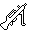
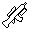
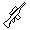
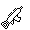

الحقائب

تحدد الحقائب في Project Reality دورك وتجهيزاتك ودورك في الفريق. يتميز PR بمجموعة واسعة من الحقائب التي يمكنك اختيارها. بشكل عام، هناك نوعان من الحقائب في Project Reality:

- الحقائب القياسية، وهي أدوار الفرقة القياسية للجنود ويمكن اختيارها مباشرة من شاشة الظهور.
- الحقائب المتخصصة، وهي أدوار أكثر تخصصًا ويمكن الحصول عليها فقط من خلال إجراء طلب خاص.

أين تبدأ

كلاعب جديد، يجب عليك دائمًا الانضمام إلى فرقة الجنود واختيار حقيبة الـ Rifleman. يمثل الـ Rifleman الجندي العادي ويمكن استخدامه دون قيود من قبل العديد من الأشخاص في الفرقة/الفريق. ترتبط جميع الحقائب الأخرى بأدوار أكثر تخصصًا وتفرض قيودًا صارمة بشأن عدد الحقائب التي يمكن استخدامها في نفس الوقت في الفرقة/الفريق.

نظرًا لهذه القيود، ومن أجل تجنب التأثير السلبي على أداء فريقك من خلال سوء استخدام حقيبة محدودة، يُوصى بشدة بأن تبدأ اللعب بحقيبة الـ Rifleman. عندما تكتسب المزيد من الخبرة وتتعلم أساسيات لعب الجنود، إذا شعرت بأنك قادر على ذلك، يمكنك طلب من قائد الفرقة تعيين دور مختلف لك. في أي حال، يجب عليك دائمًا طلب إذن من قائد الفرقة قبل تغيير الحقائب.
## _أطقم قياسية_ {#standard_kits}

**الأطقم القياسية** هي الأطقم السبعة المعروضة في شاشة الإنتاج وتمثل الأدوار التي عادة ما تشكل فرق المشاة. في الجدول التالي يمكنك رؤية نظرة عامة على الأطقم القياسية السبعة بالإضافة إلى معلومات حول عدد الأطقم من هذا النوع يمكن أن يكون في فرقة واحدة وكم يحتاج الفريق من الأشخاص لكي يتمكنوا من الإنتاج بها.

| الطقم | الحد في الفرقة الواحدة | الحد الأدنى لحجم الفرقة |
| --- | --- | --- |
| **الضابط** | 1 | 2 |
| **الطبيب** | 2 | 2 |
| **رامي البندقية التلقائية** | 1 | 4 |
| **المفتش** | 1 | 4 |
| **قاذف القنابل** | 1 | 6 |
| **مدمر خفيف للدروع** | 1 | 4 |
| **رجل بندقية** | غير محدود | 1 |

بمراعاة هذه القيود، يمكن القول أن الفرقة النموذجية المكونة من 8 أفراد عادة ما تحتوي على واحد من كل هذه الأطقم ولكن مع وجود 2 من الأطباء.

يرجى ملاحظة أن كل طقم في قائمة الاختيار على شاشة الإنتاج له زرين: **"قياسي"** و **"بديل"**. هذا لأن هناك نوعين من كل طقم. وتعتمد الاختيارات عادةً على البصريات \(نطاق، نقطة رؤية أو لا شيء\), على الرغم من أنه في بعض الحالات، خاصة مع القوى غير التقليدية، الاختيار ليس بين نطاق أو نقاط الرؤية بل بين أسلحة مختلفة تمامًا بدلاً من ذلك.

كما يجب ملاحظة أنه لأغراض اللعب، بالإضافة إلى القيود على الفرق أعلاه، يتم تحديد الحد الأقصى لعدد **قاذف القنابل** و **مدمر خفيف للدروع** أيضًا لكل فريق، وذلك اعتمادًا على عدد اللاعبين:

| الطقم | 1-7 لاعبين | 8-15 لاعبين | 16-23 لاعبين | 24-31 لاعبين | 32- 50+ لاعب |
| --- | --- | --- | --- | --- | --- |
| **مدمر خفيف للدروع** | 1 | 2 | 4 | 5 | 8 |
| **قاذف القنابل** | 1 | 2 | 4 | 5 | 8 |

هنا شرح أكثر تفصيلًا لكل طقم:

* **المقنصل**. عدة غير محدودة، تمثل الجندي العادي في القوات البرية. عادةً ما يكون مجهزًا ببندقية هجومية، وقنابل يدوية وقنابل دخانية ومجرفة. نظرًا لعدم وجود دور متخصص، يعتبر المقنصل مثاليًا للمواقع والتحركات العدوانية. كما أنه الفئة الوحيدة التي تحمل حقيبة ذخيرة، مما يتيح له إعادة تزويد زملائه في الفريق.
* **الضابط**. محدود بواحد في كل فرقة ومتاح فقط لقائد الفرقة. بالإضافة إلى التجهيزات القتالية القياسية، تأتي هذه العدة مع سلاح جانبي، وراديو ضابط وناظور. يمكنه التواصل المباشر بالصوت مع الضباط الآخرين في الفريق، ووضع علامات على الخريطة، وبناء تحصينات وطلب مهام دعمية \(مثل القصف الصاروخي، ونيران الهاون، والدعم الجوي أو الدبابات، وما إلى ذلك\). يمكنك العثور على معلومات مفصلة حول هذا الدور الحيوي في [**قسم قائد الفرقة**](the_squad_leader.md#the_squad_leader) من هذا الدليل.
* **الطبيب**. محدود باثنين في كل فرقة. يتحمل مسؤولية تقديم المساعدة الطبية في ساحة المعركة، وبالتالي، يعتبر أحد الأدوار التي تؤثر على أداء الفرقة بشكل كبير. الوعي بالمعركة وغريزة البقاء هما أمران أساسيان لهذا الدور. بالإضافة إلى بندقية هجومية، يأتي مجهزًا بعدة قنابل دخانية، وعلبة إسعافات أولية، وإبر الإيبينيفرين، وقطع الضمادات. إنه العدة الوحيدة القادرة على سحب زملاء الفريق المصابين.
* **رجل الرشاش التلقائي \(AR\)**. محدود بواحد في كل فرقة. مجهز ببندقية رشاشة خفيفة، يعتبر رجل الرشاش التلقائي، مقنصل أقل حركة وأقل تنوعًا \(لا توجد لديه قنابل يدوية\) يوفر، من ناحية أخرى، قوة نيران فائقة. تخصصه هو إطلاق نار قاهر دقيق وقاتل، والذي يكون أيضًا فعالًا للغاية في تقييد حركة الأعداء.
* **المقتحم**. محدود بواحد في كل فرقة. هو أخصائي تفجيرات يعمل أيضًا كرجل أمامي في اقتحام المباني. تشمل تجهيزاته بندقية هجومية، وخطاف تسلق لتسلق العقبات، وبندقية ذات غلقة وبعض كميات متفجرات C4 للتفجيرات التكتيكية.
* **مكافح الدبابات الخفيف \(LAT\)**. محدود بواحد في كل فرقة وبـ **8 في كل فريق**. مكافح الدبابات الخفيف مقنصل مجهز ببندقية هجومية ونظام سلاح مضاد للدبابات الخفيف المحمول. يكون دوره الرئيسي هو العمل كعنصر مكافح للدبابات فائق الخفة، بقدرته على ردع وتعطيل المركبات الخفيفة والمركبات ذات الدروع الخفيفة. **ومع ذلك، فإنه غير فعال ضد المركبات ذات الدروع الثقيلة أو الدبابات.**
* **القناص**. محدود بواحد في كل فرقة وبـ **8 في كل فريق**. عادةً ما يكون مجهزًا بقاذف قنابل تحت السبطانة مرتبط ببندقيته الهجومية. يكون العمل الرئيسي له هو استهداف المناطق ذات الرؤية المنخفضة حيث يُشتبه في وجود العدو، بالإضافة إلى مضايقة المركبات الخفيفة. إنه مفيد بشكل خاص للمواجهات عن بُعد ولمحاربة الأعداء المحاصرين داخل المباني.

أطقم الاختصاصيين

بالإضافة إلى الأطقم القياسية الموصوفة أعلاه، توجد في PR مجموعة واسعة من **أطقم الاختصاصيين** قادرة على أداء مهام متخصصة للغاية. تشمل بعض هذه الأطقم القاذف الثقيل للدبابات، ومهندس القتال، والرامي الماهر، والقناص، أو رامي الدفاع الجوي، بين آخرين.

لا يمكن الظهور مباشرة بأحد هذه الأطقم المحدودة والمتخصصة. للحصول عليها، يحتاج اللاعب إلى طلبها من صناديق الإمدادات أو الآليات المتحالفة وفقًا لإجراء موصوف [أدناه](kits.md#kit-request). علاوة على ذلك، واعتمادًا على عدد اللاعبين في الفريق، تكون **هذه الأطقم محدودة بعدد معين منها لكل فريق**. في الجدول التالي، يتم تلخيص هذه القيود:

| الطقم | 1-7 لاعبين | 8-15 لاعبًا | 16-23 لاعبًا | 24-31 لاعبًا | 32- 50+ لاعبًا |
| --- | --- | --- | --- | --- | --- |
| **قاذف الرشاش** | 1 | 2 | 3 | 3 | 4 |
| **الرامي الماهر** | 1 | 2 | 3 | 3 | 4 |
| **رامي الدفاع الجوي** | 1 | 2 | 3 | 3 | 4 |
| **المراقب** | 0 | 1 | 1 | 2 | 2 |
| **مهندس القتال** | 0 | 1 | 1 | 2 | 2 |
| **رامي الدفاع الجوي** | 0 | 1 | 1 | 2 | 2 |
| **القناص** | 0 | 1 | 1 | 2 | 2 |
| **القاذف الثقيل للدبابات** | 0 | 1 | 1 | 1 | 1 |

علاوة على ذلك، يتطلب فريقك أيضًا عددًا أدنى من اللاعبين قبل أن تتمكن من طلب هذه الأطقم:

| الطقم | الحد الأدنى لحجم الفريق |
| --- | --- |
| **قاذف الرشاش** | 6 |
| **الرامي الماهر** | 6 |
| **رامي الدفاع الجوي** | 4 |
| **المراقب** | 2 |
| **مهندس القتال** | 3 |
| **رامي الدفاع الجوي** | 3 |
| **القناص** | 3 |
| **القاذف الثقيل للدبابات** | 3 |

نظرًا للطبيعة المقيدة لهذه الحقائب ، يُوصى **بشدة** بعدم استخدامها من قبل اللاعبين الجدد وغير المتمرسين. إذا فعلوا ذلك ، فإنهم يخاطرون بإهدار وفقدان هذه الأصول الفريقية الحاسمة ، مما يترك الفريق في موقف تحت المراقبة. **تذكر دائمًا أن تطلب إذن قائد الفريق قبل استخدام أي من هذه الحقائب المتخصصة**.

وهنا يتبع وصف مفصل لكل حقيبة متخصصة:

* **رامي الرشاش \(MG\)**. على الرغم من كونه نسخة أثقل وأكثر سخونة من رامي البندقية التلقائية \(AR\), إلا أنه بفضل قوته النارية الأكبر، يعتبر رامي الرشاش جنديًا فتاكًا قادرًا على تثبيت فرق كاملة ولا يضاهى في المواجهات على مسافات بعيدة.
* **رامي القنص**. يتفوق رامي القنص في توفير نيران منخفضة السرعة وعالية الدقة لفريقه. إنه مُبارز ماهر عند التعامل مع الأهداف أو الأعداء خارج نطاق الجندي العادي.
* **رامي البنادق المضادة للأفراد \(AP\)**. يأتي رامي البنادق المضادة للأفراد مزودًا بألغام قوية مضادة للأفراد مجهزة بمفجرات عن بعد. إنه مفيد للغاية في التحضير للكمائن أو استخدام متفجراته للدفاع عن الأهداف التكتيكية.
* **قناص**. يتألق القناص أثناء المهام الاستطلاعية وتوفير المعلومات للفريق بشأن حركة العدو ومواقعه. مجهز ببندقية قنص عالية الدقة، كما أنه قادر على مواجهة الأعداء من مسافات بعيدة جدًا. نظرًا لقيوده البالغة 2 لكل فريق، في PR، يُعتبر أمرًا مستهجنًا بشدة استخدام عدة القناص للمهام الفردية الأركادية.
* **مرشد**. يأتي المرشد مزودًا بخطاف تسلق ومناظير، مما يمكنه من تحديد مواقع استراتيجية لجمع المعلومات الرئيسية من ساحة المعركة. كما أنه قادر على استخدام جهاز توجيه الليزر الخاص به لتحديد الأهداف لضربات جوية. يتضمن دوره عادة دعم عناصر الدبابات والدعم الجوي القريب، بالإضافة إلى القناصين.
* **مهندس قتالي**. متخصص في المتفجرات والتدمير. مجهز بألغام أرضية مضادة للمركبات، وهو الشخص المعين لإنشاء حقول الألغام أو تفكيكها. تذكر أن الألغام تُنشط من قبل الحلفاء والقوات العدو! كما أنه يأتي أيضًا مع عدة متفجرات للتدمير ويمكنه إصلاح المركبات الخفيفة.
* **رامي الدفاع الجوي \(AA\)**. يأتي مجهزًا بنظام سلاح دفاع جوي محمول، مما يجعله الشخص المناسب لردع وإسقاط عناصر الجو العدو. تقييده بـ 2 لكل فريق يجعله أصولًا حرجًا للغاية. لا تهدر هذه العدة!
* **مدمر الدروع الثقيل \(HAT\)**. يُعتبر مدمر الدروع الثقيل تهديدًا فعالًا ضد الدروع ويمكنه تدمير المركبات بحسم حتى على مسافات بعيدة. تقييده العالي بـ \(**1 لكل فريق**\) يجعل هذه العدة حرجة للغاية. فقدانها أو إهدارها يمكن أن يغير مجرى المعركة. لهذا السبب، يُطلب بشدة من اللاعبين الذين ليس لديهم الخبرة اللازمة الابتعاد عنها.

## _أطقم التمرد_ {#insurgency-kits}

فريدة من نوعها لبعض القوات الغير منتظمة و/أو وضع اللعبة التمردية هي عدد من الأطقم للاستخدام في أنماط الحرب غير المتماثلة. غالبًا ما تكون أقل تطورًا من العتاد الصادر عن الجيش من حيث القدرة، حيث يتم توزيع أطقم المتمردين مزيجًا متنوعًا من الأسلحة النارية ومجموعة متنوعة من الأدوات المحلية للمساعدة في التخفيف من الفجوة المذكورة في القدرة. يُلاحظ بشكل خاص التمرد العراقي حيث إن جدول أسلحة الجنود العاديين لديهم يختلف بشكل كبير عن جميع الفصائل الأخرى وبالتالي يبرز الحاجة إلى فحص أقرب:

**أطقم شاشة الإنتاج العراقية للمتمردين**
* **قائد الخلية**. النسخة العراقية من طقم الضابط.
*  
   
   
  **المتمرد**. نموذج فئة الجندي العادي للمتمردين. لا تتميز جميعها بالذخيرة الإضافية، وتستخدم الألغام العبوية أو القنابل المضادة للدبابات بدلاً من ذلك. تتنوع مجموعتهم من أنظمة الأسلحة من بنادق الصيد إلى رشاشات الرصاص الفردية إلى بنادق الهجوم أو القتال.
* **مهندس الطرق**. فئة دعم أخرى. يعمل مهندسو الطرق كمزيج من مهندس القتال وفئة الجندي العادي المضاد للدروع. الغرض الرئيسي منهم هو إعداد كمائن ضد الجنود الأعداء والمركبات، فضلاً عن منع المنطقة. لديهم وصول محدود إلى الأسلحة النارية ويجب أن يبتعدوا عن المعركة لأنهم لا يمرون كمدنيين وهم أهداف قانونية. ليس لديهم وصول إلى مفتاح ربط كما هو الحال مع مهندس القتال الحقيقي.
* **المتعاون**. تتميز هذه الفئة الفريدة بعناصر من فئة الطبيب مع أسلحة شخصية خفيفة، ولكن يمكنهم أيضًا الاختيار من الذهاب بدون سلاح إلى الصراع باستخدام تحميلة الطقم البديلة. خارج إعادة الإحياء والشفاء للأصدقاء أو المساعدة في استخدام خطافهم، الغرض الرئيسي منهم هو تغذية المواقع العدائية ومعلومات أخرى للفريق مع البقاء كشاهد لا يشتبه به في الصراع. قتل المتعاون تحت ظروف معينة يشكل انتهاكًا لقواعد الاشتباك، مع عقوبة للقاتل وفريقه. لذلك يجب على القوات التحالفية كبح أنفسها عن إطلاق النار على الجميع عند الرؤية. من ناحية أخرى، المتعاونون مصادر قيمة لنقاط المعلومات لأن قدرتهم على الدفاع عن أنفسهم ضد الاعتقال محدودة للغاية على أفضل تقدير وغالبًا ما يكون لعبة صيد الفأر بين المنازل والأسطح. يُسمح بوجود اثنين فقط من هؤلاء في فريق في أي وقت.

أطقم الانتفاضيين لالتقاط الأسلحة

لا يمكن للمتمردين العراقيين، في معظم الأحيان، الوصول إلى بعض أسلحتهم الثقيلة من قائمة الظهور. بدلاً من ذلك، يقومون بالتقاطها أو طلبها من محطة إصلاح المركبات في القاعدة الرئيسية أو من مخزن نشط. تنشأ مخازن الانتفاضيين العراقيين عددًا من البنادق الآلية التي لا يمكن الوصول إليها بواسطة فرقة من المتمردين. في قواعدهم الرئيسية، يمكن التقاط أعداد محدودة من أطقم القناصين، والقناصين، والمهندسين، والقاذفات الصاروخية أيضًا.

الفئة الأخيرة الفريدة للقوات الانتفاضية هي المدني: عند إسقاط طقم، يتم تزويد اللاعب بطقم وهمي. تحصل بعض الفصائل غير النظامية على تأثير حالة المدني عند استخدامه لمدة 2 دقيقة أو أكثر. يعمل طقم المدني، تمامًا مثل المتعاون المذكور أعلاه، ككشاف وعامل ردع ضد الهجمات العسكرية، لكنه ليس لديه وسائل لمساعدة الفريق من حيث المعدات الأخرى للدعم.

يمكن العثور على شرح أعمق حول المتعاون والمدنيين في قسم منفصل من الدليل [هنا](the_civilian.md#the_civilian).
## أطقم المركبات

بالإضافة إلى الأطقم الموصوفة بالفعل، هناك بعض الأطقم الخاصة للوصول إلى المركبات العسكرية الكبيرة والطائرات؛ وتسمى هذه الأطقم **الطاقم** (للمركبات المدرعة) و**الطيار** (للطائرات). بدونهم، يصبح من المستحيل الوصول إلى وظائف مفتاحية في هذه المركبات وسيتم عرض شاشة سوداء فقط عند دخول السائق، والمدفعي، والمساعد، وبعض المقاعد الأخرى في المركبة.

إنهما من بين الأطقم القليلة التي ليس لها قيود على عدد الأشخاص الذين يجب أن يكونوا في الفرقة لطلبها وعلى عدد الأطقم التي يمكن إصدارها لكل فرقة بشكل عام. كأطقم متخصصة، فإن اختيار أسلحتهم محدود للغاية، حيث تصدر عدد قليل من الفصائل بنادق لطواقمها، ويتلقى الطيارون فقط مسدسات. كونهما نوعًا من الأطقم المتخصصة، فإنه ليس من الممكن أن يتم إنشاؤهما مباشرة ويجب طلبهم كالمعتاد (انظر [أدناه](kits.md#kit-request)). ومع ذلك، ليس هناك أي قيود على عدد الأطقم التي يمكن أن تكون في الفريق في نفس الوقت وبالتالي يمكن اعتبارها أيضًا أطقمًا غير محدودة.

* **الطيار**. الطيار هو الأطقم الوحيد القادر على تشغيل المروحيات والطائرات ذات الأجنحة الثابتة. يأتي مجهزًا بسلاح جانبي ومظلة وقنبلة دخان إشارة. لا تحاول تشغيل الطائرات بدون تجربة مناسبة.
* **الطاقم**. هو الأطقم الوحيد القادر على تشغيل المركبات المدرعة. يتم تجهيز الطاقم بسلاح مدمج للدفاع عن النفس وبناظير لدراسة ساحة المعركة. عادةً ما يحتاج السائق والمدفعي في المركبة المدرعة إلى أطقم الطاقم.

إجراء طلب الطقم

بمجرد الظهور، وإذا تم تحقيق بعض الشروط، يمكنك طلب طقم جديد (سواء كان قياسيًا أو متخصصًا) من صندوق إمدادات حليف أو مركبة مدرعة. عادةً ما يجب تحقيق الشروط الثلاثة التالية لطلب طقم:

- **الإذن**. يجب أن يكون لديك إذن قائد الفرقة. هو من يقرر من يحصل على ما.
- **الموقع**. يجب أن تكون في المكان المناسب لطلب الطقم - بجوار صندوق إمدادات حليف أو مركبة مدرعة.
- **الأعداد المطلوبة**. يجب أن تكون جزءًا من فرقة تحتوي على الحد الأدنى المطلوب من الأعضاء.

يمكن أن تقيد الإجراءات التالية حقك مؤقتًا في طلب الطقم:

| الشرط | العقوبة الزمنية |
| --- | --- |
| إما أن تظهر، أو تطلب وتحصل على، طقم محدود | غير قادر على طلب طقم لمدة 2 دقيقة |
| تغيير الفرق | محظور لمدة +2 دقيقة |
| قتل زميل (قتل الفريق) يحمل طقم محدود | محظور لمدة +3 دقائق |
| إرسال طلبات عديدة للطقم في وقت قصير | محظور لمدة +30 ثانية |
| قتل مدني ينتهك قواعد الاشتباك (التمرد) | محظور لمدة +10 دقائق |
لطلب مجموعة، يجب اتباع تسلسل مفتاح معين:

| تسلسل المفاتيح لطلب مجموعة |
| --- |
| 1. اضغط واستمر في الضغط على **مفتاح الراديو الثانوي (T)** (سيظهر _Commo Rose_), |
| 2. باستخدام الماوس، حدد الخيار المركزي في Comm Rose (**REQUEST / DROP KIT**) واضغط عليه بالزر الأيسر. سيتم فتح قائمة بجميع المجموعات فيها |
| 3. حرك الماوس لتحديد المجموعة المرغوبة. سيعرض العنصر المميز على الشاشة الرئيسية بعد ذلك STD و ALT للسماح بطلب تحميل مجموعة قياسي أو بديل. انقر بالزر الأيسر على النسخة المميزة التي تختارها لطلب المجموعة |
| 4. إذا تم تلبية جميع الشروط، سيتم اختيار المجموعة المطلوبة تلقائيًا، مع التخلص من المجموعة الحالية الخاصة بك في العملية |

إذا تم رفض طلبك، سترى رسالة نصية صفراء تشرح السبب:

إذا طلبت المجموعة في الموقع الخطأ:

* **"يجب أن تكون قريبًا من صندوق إمداد صديق أو APC لطلب هذه المجموعة"**, أو
* **"يجب أن تكون قريبًا من صندوق إمداد صديق أو مركبة لطلب هذه المجموعة"**

إذا فشلت الفرقة التي تنتمي إليها في متطلبات الفرقة:
* **"غير متاح بسبب قيود الفرقة"**

إذا تم منح جميع المجموعات المسموح بها بالفعل للفريق:

* **"تم منح جميع هذه المجموعات"**

أسباب أخرى محتملة:

* **"غير متاح لقواتك"**
* **"لا يمكنك الحصول على مجموعة محدودة أخرى بعد وقت قصير من آخر طلب"**
* **"أنت جديد في هذه الفرقة، قدم الطلب مرة أخرى بعد دقيقة"**

## _إجراء إسقاط المجموعة_ {#drop-kit}
في بعض الحالات ، قد ترغب في التخلص من حقيبتك. عادة:

* اخترت عدوًا بشكل متعمد أو غير متعمد \(الذي سيقتلك بعد 30 ثانية ما لم تتخلص منه\),
* أنت طبيب جراح مصاب وترغب في إعطاء حقيبتك لشخص آخر حتى يتمكنوا من علاجك،
* ترغب في تبديل الحقائب مع شخص أكثر خبرة أو مهارة منك،
* تريد أن تصبح مدنيًا أثناء اللعب في وضع الثورة.

ما عليك سوى اتباع هذا التسلسل:

| تسلسل مفاتيح للتخلص من حقيبتك |
| --- |
| 1. اضغط واستمر في الضغط على **مفتاح الراديو الثانوي \(T\)** |
| 2. حدد الخيار الأوسط في _Commo Rose_ \(**طلب / إسقاط الحقيبة**\) وانقر بزر الفأرة الأيمن عليه. سيتم إسقاط حقيبتك القديمة تحتك ، وسترتدي حقيبة غير مسلحة غير مرئية. |

يرجى ملاحظة أن الحقيبة على الأرض ستختفي بعد حوالي 5 دقائق طالما لم يتم اختيارها في الوقت الفاصل. تصبح الحقائب التي تختفي في النهاية والتي تكون متاحة بشكل محدود للفرق أو الفرق قابلة للطلب مرة أخرى من مجموعة الحقائب للفرقة أو الفريق عندما تختفي.

تظهر الحقيبة المسقطة على الأرض على شكل حزمة من الملابس العسكرية مع بعض الإضافات ، اعتمادًا على الفصيل ، قد تكون العناصر على سبيل المثال في نمط التمويه لتلك الفصيلة ، إلخ. يمكن للاعبين الآخرين التقاط الحقيبة \(على الرغم من أن الزملاء فقط قادرون على استخدامها لفترات طويلة\) عن طريق الذهاب بالقرب من العناصر والضغط على **\(G\)** لتبديل الحقيبة مع حقيبتهم الحالية. طالما أن حقيبتك التي تم التخلص منها سابقًا لم تختفي ، يمكنك دائمًا الذهاب والتقاطها مرة أخرى.
