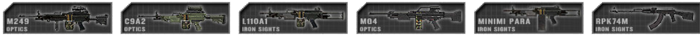
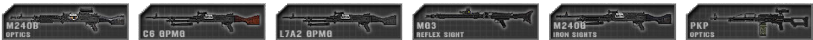

# الأسلحة والمعدات
## _الأسلحة والمعدات العامة_ {#general-weapons-equipment}

تحتاج الأسلحة بعد فترة طويلة من الحركة أحيانًا إلى لحظة لكي تكتسب الدقة وتطلق النار بدقة على الأهداف على مسافات بعيدة. لن تتأثر المواجهات على مسافات قريبة بالانحراف الناتج عن الحركة. يتيح هذا للاعبين إجراء تصحيحات موضعية صغيرة دون تعرضهم لعدم دقة السلاح. الاضطجاع يقلل بشكل كبير من دقة اللاعب لبضع لحظات ولكن يوفر أعلى دقة لاستهداف الأهداف على مسافات بعيدة بمجرد استعادة توجيه اللاعب.

تكون معظم الأسلحة مضبوطة على التشغيل شبه الآلي افتراضيًا.

عند التصويب باستخدام الأسلحة غير المنظارية، يمكنك الضغط على **Shift** لتركيز توجيهك، مما يوفر لك تكبيرًا صغيرًا على حساب الرؤية الجانبية.

تحتاج الأسلحة إلى إعادة تحميل يدويًا (افتراضيًا: **R**). لا يتأثر انحراف الأسلحة بوجود بصريات أو نقاط تصويب من الحديد. لاحظ أن مؤشرات انخفاض الرصاص الموجودة في بعض البنادق ذات المنظار هي مجرد عرض ولا تعمل؛ يبدأ تأثير انخفاض الرصاص بما يكفي ليكون مرئيًا من مركز الشبكة فقط عند مسافات معتدلة عالية (500 متر وما فوق) وهو أكثر لطفًا بكثير مما يشير إليه العلامات على المدى. نقطة الهدف تقع في وسط الشبكة، بغض النظر عن أي مؤشرات مدى قد تشير إليها النطاق الفعلي للعسكريين. تصنف الأسلحة في PR:BF2 إلى فئات مختلفة، غالبًا ما تكون مرتبطة بالحقائب التي يتم استخدامها بها:

**بنادق الهجوم** عادة ما تكون متوفرة في عدة متغيرات مع نقاط تصويب مختلفة. يتمتع التصويب بالبصريات المكبرة بميزة دقة ولكن يعوقه تقليل كبير في الرؤية الجانبية مقارنة بنقاط البصر العاكسة أو نقاط التصويب من الحديد.

القنابل اليدوية تحت السلاح \(UGL\) تُركب على الجانب السفلي من بنادق الاقتحام وتُستخدم ضد مجموعات من الأعداء أو أفراد لا يمكن ضربهم بالنيران المباشرة. كما أنها فعالة ضد المركبات غير المحمية ويمكن استخدامها بشكل فعال على مسافات تتجاوز 200 متر. تحتاج القنابل إلى السفر 28 مترًا قبل أن تنشط أو لن تنفجر. يمكن للقنابل اليدوية أيضًا إطلاق قنابل دخانية تُستخدم لتعتيم رؤية العدو. يمكن تعيين مدى المُطلق باستخدام نظرة سلمية مرفقة بالسلاح. أثناء التصويب بهذه النظرة، يمكن استخدام القائمة الرئيسية للراديو \(الافتراضي: **Q**\) لتعيين المدى إلى مسافة الهدف [\(انظر تغيير مدى الرؤية\)](weapons_and_equipment.md#altering-sighting-range). عند استهداف أهداف أعلى أو أقل من المسافات المحددة مسبقًا، من المهم تعويض ذلك. في الخرائط الليلية، سيكون لدى القناص الوصول أيضًا إلى قذائف إضاءة.
> _Kits: Grenadier_

الأسلحة الجانبية تُستخدم تقليديًا من قبل قادة الفرق في القوات التقليدية كوسيلة احتياطية وعلامة على السلطة. كما يتم تجهيز القناصة بسلاح جانبي للدفاع عن النفس أثناء الانتقال. بعض المتمردين الذين لا يمتلكون سلاحًا رئيسيًا يستخدمون سلاحًا جانبيًا بدلاً من ذلك.
المجموعات: القناص

الأسلحة الجانبية تستخدم تقليديًا من قبل قادة الفرق في القوات التقليدية كوسيلة احتياطية وعلامة على السلطة. يتم تجهيز القناصة أيضًا بسلاح جانبي للدفاع عن النفس أثناء الانتقال. بعض المتمردين الذين لا يمتلكون سلاحًا رئيسيًا يستخدمون سلاحًا جانبيًا بدلاً من ذلك. البنادق القناصة قاتلة عند استخدامها في المسافات القريبة. يمكن استخدامها أيضًا لاختراق الأبواب والبوابات المغلقة. يمكن اعتقال المدنيين المتمردين باستخدام طلقات البكشوت التي تحاكي تعطيل معلوماتي بطلقات مطاطية. تستخدم بعض البنادق القناصة طلقات الاختراق التي يمكن استخدامها فقط لاختراق الأبواب المغلقة. تستخدم البنادق القناصة أيضًا لتدمير صناديق العدو (لصناديق كبيرة، اضرب اللوح الخشبي للحصول على أقصى تأثير).

> _الأطقم: الرامي البندقية على القوات التقليدية. مجموعات متنوعة من الثوار / حماس / طالبان / ميليشيا_

**بنادق القنص المعينة \(DMR\)** تُستخدم لاستهداف الأهداف الرئيسية البعيدة بنيران دقيقة. يمكن نشرها لزيادة دقتها بشكل كبير على حساب القدرة على التنقل. يؤثر وضع اللاعب على دقة الأطوال البعيدة أثناء نشر بندقية القنص المعينة، والموضع الأمثل لإطلاق النار هو الاستلقاء. عند إطلاق النار على أهداف تزيد عن 500 متر، يبدأ الرصاص بالهبوط. قم برفع البندقية قليلاً فوق نقطة الاصطدام المقصودة إذا كان الرصاص لا يزال يصطدم منخفضًا، وقم بضبطه حسب الحاجة وحاول مرة أخرى. من الضروري لا يزال تعويض الأهداف المتحركة على مسافة بعيدة. لزيادة الدقة، يجب على الرامي الانتظار حوالي ثانية واحدة لكل طلقة مطلقة.

> _الأطقم: الرامي_

**بنادق القنص** تُستخدم لاستهداف الأهداف ذات الأولوية العالية على مسافات بعيدة. معدل إطلاق النار لديها بطيء نظرًا لاستخدامها بنظام الإغلاق بالمسمار. يؤثر وضع اللاعب على دقة البندقية القنص على المسافات البعيدة. إنها النوع الأكثر دقة من الأسلحة التي يحملها الجنود وتصيب في مخروط صغير جدًا بمجرد استقرار الانحراف. تمامًا مثل بنادق DMR، ليس من الضروري تعويض الهبوط الناتج عن الرصاص ما لم تتجاوز مسافة الهدف حوالي 500 متر، ولكن الاستهداف لصدر العدو الذي يقف بشكل مستقيم عند مسافة أعلى من المعتاد من المرجح جدًا أن يصل إلى منطقة البطن، مما سيجعله عاجزًا. ستحتاج فقط إلى استهداف الأهداف البعيدة، التي عادة ما تكون وراء الغطاء أو في وضع الاستلقاء، لتستوجب عليك استهداف فوق الصدر أو الرأس لتحقيق الإصابة. تتم الحصول على أقصى درجات الدقة من خلال الانتظار لمدة حوالي 8 ثواني بعد الحركة و 4 ثواني بعد الإطلاق. إذا كنت على مسافة بعيدة ولم تستطع رؤية تأثير الرصاص بسبب التشغيل اليدوي مع المسمار، بدلاً من ترك زر النقر الأيسر عند الإطلاق، اضغط عليه لإيقاف التشغيل اليدوي.

> _الأطقم: رجل الطاقم، الرامي المضاد للدروع، الدبابة الثقيلة المضادة للدبابات، قائد الفرقة، الرامي البندقية على القوات غير التقليدية_

**الرشاشات الخفيفة \(LMG\)** تُستخدم لقمع العدو ويمكن أن تدمر فرق العدو عند استخدامها في المدى المتوسط أو في حالات الكمين. يمكن نشرها لزيادة دقتها واستقرارها ومداها بشكل كبير. عند استخدام رشاش LMG المنتشر، تزيد الدقة ولكن فقط عندما تكون القابلية للحركة دنياً ولا تصلح للاستخدام عند التنقل. يقلل الوضع المنتشر أيضًا من عدم الدقة الناتجة عن إطلاق النار ويسمح للمستخدم بإطلاق نيران متقطعة لفترات أطول بدقة أكبر من جميع الأسلحة التلقائية المحمولة الأخرى. اعتمادًا على المسافة إلى العدو، فإن إطلاق نيران متقطعة تتراوح بين 3 إلى 7 طلقات مع فترات قصيرة هو الطريق المثالي لاستخدام هذه الأسلحة بأقصى كفاءة. تحتوي الرشاشات LMG التي تعمل بحزام عادة على 100 طلقة، وبعضها أكثر، ولكن يستغرق إعادة تعبئتها وقتًا طويلاً، مما يعني أن الرشاشات التي تعمل بالمجلة أسرع في هذا الصدد ولكن يجب على المستخدم أن يكون أكثر وعيًا بعدد الطلقات التي أطلقها من المجلة الحالية. يؤثر وضع اللاعب على دقتها عن بعد، والوضع الأمثل لإطلاق النار هو الاستلقاء. في هذا الوضع، ستحصل على أعلى دقة عند المدى البعيد. يُستخدم الوضع غير المنتشر عندما يكون اللاعب متنقلًا ويحتاج إلى الرد على النيران دون تأخير في المدى القصير.

> _الأطقم: رجل البندقية التلقائية_

**الرشاشات المتوسطة \(MMG\)** هي نسخة متوسطة من رشاش الرشاشة. تستخدم طلقة أكبر بقياس 7.62 ملم والتي يمكن أن تكون لها تأثيرات مدمرة في بعض الحالات وتكون ممتازة لقمع العدو على مسافات بعيدة، ولكنها محدودة بأنها تعمل فقط في وضعية النشر بسبب الوزن. بعد فترات طويلة من الحركة، تستغرق حوالي 7 ثوانٍ للوصول إلى أقصى دقة لإطلاق النار. على الرغم من أنها ليست بنفس القدر، يمكن للرشاشات المتوسطة، تمامًا مثل نظرائها الصغيرة، إطلاق نيران متقطعة طويلة من النار التلقائية أو النار السريعة مع عقوبة دقة أقل وارتداد أقل من الأسلحة التلقائية الأخرى. نظرًا لزيادة الضرر الذي تحمله وسعتها العالية، فإنها تستخدم أيضًا عادة لإلحاق الضرر بمركبات العدو غير المصفحة وركابها. على عكس الرشاشات الخفيفة، فإن الرشاشات المتوسطة جميعها تعمل بحزام وبالتالي تتطلب بعض الوقت لإعادة التعبئة.

القنابل اليدوية لها نصف قطر انفجار كبير ولكنها غير دقيقة عند رميها أثناء التحرك أو القفز ومداها قصير نسبيًا. يستغرق حوالي 5 ثوانٍ حتى تنفجر. بعض القنابل مثل قنابل RGO و RKG تنفجر عند الاصطدام. القنبلة RKG هي أيضًا مثال على قنبلة مخصصة للاستخدام ضد المركبات. لتحذير حلفائك قبل رمي قنبلة يمكنك استخدام مفتاح الراديو الرئيسي (الافتراضي: Q) أثناء حمل القنبلة لتصرخ بتحذير، أو استخدام Mumble بديلاً. الضغط على زر الماوس الأيمن مع قنبلة في يدك سيسقطها عند قدميك (استخدم بحذر)، بينما الضغط المستمر سيسمح لك بتوجيهها (استخدم إبهامك كمرجع) وترك زر الماوس الأيمن سيقذف القنبلة كالمعتاد.

يمكن للقوات غير التقليدية استخدام الحجارة، التي لا تسبب سوى إصابات طفيفة عند ضرب لاعب واحد ولكن عدة ضربات قد تكون قاتلة.

السكاكين والسكاكين البيونيت قاتلة على الفور إذا ضربت العدو. يُعتبر قتل المقاتلين المتمردين الأعداء بالسكين عملية اعتقال. تستغرق الهجمات القتالية غير المسلحة حوالي 5 ضربات لقتل العدو.

قاذفات الدبابات الخفيفة (LAT) تستخدم ضد الأهداف غير المدرعة والمدرعة بشكل خفيف. ليست فعالة ضد الدروع المتوسطة أو الثقيلة. يستغرق بعض الوقت لإعداد القاذف للإطلاق عند التبديل إليه، ويستغرق الأمر بعض الوقت لتثبيته بعد التحرك أيضًا. تستخدم العديد من القاذفات نقاط الرؤية الحديدية مع خيار التعديل. للتعديل، اضغط واستمر في الضغط على مفتاح الراديو الرئيسي (الافتراضي: Q)، ثم حدد المدى عبر النقر الأيسر [\(انظر تغيير مدى الرؤية\)](weapons_and_equipment.md#altering-sighting-range). تأتي القاذفات الأخرى مزودة بنقطة رؤية بعلامات مدى عمل فعالة وبالتالي لا تحتاج إلى توجيه. أخيرًا، تستخدم مجموعة صغيرة من الأنظمة نطاقًا ولكن يجب توجيهها قبل الإطلاق. عند استهداف الأهداف بين المدى المحدد، يمكنك تعويض زاوية الهجوم يدويًا عن طريق رفع هدفك أو خفضه للحفاظ على ضربة فعالة على الهدف.

_Kits: Rifleman AT, Militia / Taliban / Hamas Anti Tank_

**المُطلقات الثقيلة للدبابات \(HAT\)** تُستخدم لاستهداف المركبات المدرعة. يمكنها تدمير الدروع الخفيفة والمتوسطة بضربة واحدة. ومع ذلك، يمكن للدبابات الرئيسية \(MBTs\) تحمل ضربات متعددة من الجهة الأمامية ويُوصى بالإطلاق فقط عندما يكون بإمكانك ضرب الجوانب أو الخلف أو الجزء العلوي من الدبابة، حيث يُنصح بالإطلاق من الجهتين الجانبيتين أو الخلفية للقضاء على الدبابة بضربة واحدة خارج بعض رؤوس الحرب المحددة. لتجهيز السلاح للإطلاق، يجب أولاً تثبيت السلاح لفترة زمنية كبيرة، تقدر بحوالي 10 ثوانٍ. على عكس الأسلحة القتالية المضادة للدبابات الخفيفة \(LATs\)، فإن معظم المُطلقات الثقيلة للدبابات \(HATs\) باستثناء تلك المستخدمة من قبل القوات غير التقليدية تأتي مجهزة بنطاق يحتوي على علامات المدى على الأقل. قد تكون بعضها بدون علامات مدى وبدلاً من ذلك تكون لديها القدرة على أن تكون موجهة من قبل المشغل بعد الإطلاق، مما يجعلها نظام صواريخ موجهة مضادة للدبابات \(ATGM\) بدلاً من مجرد مُطلق صواريخ.

عند استخدام نظام الصواريخ الموجهة مضادة للدبابات \(ATGM\)، يجب على المشغل الضغط على مفتاح الإطلاق حتى يتم إطلاق الصاروخ \(الوقت يتفاوت اعتمادًا على نظام الصاروخ\). يُشار إلى أن الصواريخ تمتلك مدى توجيهي يبلغ حوالي 600 متر قبل أن ينقطع السلك المستخدم لإرسال أوامر التحكم إلى الصاروخ، حيث يبدأ الصاروخ بالدوران بشكل لا يمكن التحكم فيه ومن غير المرجح أن يصيب الهدف. تعتمد الصواريخ على السلك أيضًا للتحكم في الصاروخ مما يجعل من المستحيل توجيه الصاروخ حول زوايا المباني والأجسام الصلبة من أي نوع. كما تسافر الصواريخ في حركة دائرية طفيفة حول نقطة الهدف، مما يتطلب من المشغل إعطاء الصاروخ بعض المساحة للتحرك. قد لا يمكن إطلاق بعض هذه الأنظمة السلاحية من وضع الاستلقاء، حيث محاولة الإطلاق ستجعل النظام السلاحي غير قابل للتشغيل تمامًا. إذا حدث ذلك، يجب إسقاط الطقم، مما يؤدي إلى اختفائه بعد بضع دقائق. [\(انظر إلى قسم إجراءات إسقاط الطقم\)](kits.md#drop-kit)

نظام الصواريخ الموجهة مضادة للدبابات \(ATGM\) قليلة العدد تحتوي على وضع هجوم على الجزء العلوي يتم تنفيذه تلقائيًا يمكن تحديده قبل الإطلاق عبر مفتاح القائمة الرئيسية \(الافتراضي: Q\) عند التصويب بالنظام السلاحي. يزيد وضع الهجوم على الجزء العلوي من فرص الضرب بنجاح على درع الجزء العلوي الأضعف للهدف، ولكن يستغرق المزيد من الوقت للصاروخ للارتفاع إلى الارتفاع المطلوب والانغماس نحو الهدف، كما أنه يزيد من المسافة الدنيا التي يمكن استخدام السلاح فيها إلى حوالي 150 مترًا، لذا قد يرغب المشغل في اختيار وضع العمل المباشر بدلاً من ذلك لتقليل وقت الرحلة للصاروخ والمسافة الدنيا. يرجى ملاحظة أن هذه الصواريخ "ذكية" ولا تعتمد على التحكم بالأسلاك لتوجيهها، بل توجه بناءً على نقطة الاصطدام المختارة.

بسبب أسباب اللعبة، فإنها ليست قادرة على الاستهداف والنسيان بقدرات التوجيه مثل نظرائها في الحياة الواقعية.

_Kits: القوات التقليدية مكافحة الدبابات_

**الصواريخ الجو-أرض \(SAM\)** تُستخدم لإسقاط الطائرات العدو. لتحقيق ذلك، تحتاج إلى اكتساب الهدف بصريًا من خلال تتبعه في الجو. بمجرد تحديد المسار، ستسمع صوتًا منخفضًا، وبعد بضع ثوانٍ عند تحقيق القفل ستسمع صوتًا عاليًا ثانويًا، وفي هذه النقطة يمكنك النيران. تعوق التدابير الوقائية مثل الشرارات من تدمير هدفك بشكل فعال، لذا زاوية الهجوم الخاصة بك بالنسبة لاتجاه سير المركبة أمر حاسم لتحقيق الإصابة. سيتلقى الطيارون الأعداء صوت تحذير بعد بضع ثوانٍ من تعرضهم للقفل بواسطة صاروخ جو-أرض مما يمنحهم الوقت للتحرك بعيدًا عن التهديد. بعض الفصائل القديمة مثل فصائل جزر الفوكلاند مع الـ Blowpipe لن تمتلك أسلحة مضادة للطائرات مع قفل الهدف وستحتاج إلى توجيه يدوي.

_Kits: مضادة للطائرات_

**المتفجرات التي يتم تفجيرها عن بعد** هي متفجرات يتم تفجيرها بواسطة جهاز تحكم عن بعد يتم تشغيله بواسطة الشخص الذي وضع المتفجرات وعادةً ما تُستخدم للكمائن والدفاع. **الألغام المضادة للأفراد** \(كلايمور\) تستغرق 5 ثوانٍ للتفجير بعد وضعها. عند تشغيل المفجر، سيشير صوت عند انتهاء هذا الوقت. إذا تم تفجير المتفجرات مبكرًا، فلن تنفجر على الإطلاق. لا تحتوي المتفجرات العابرة عن هذا الحماية. يجب تثبيت معظم المتفجرات وأنت في وضع الاستلقاء. يمكن للاعب وضع ما يصل إلى 4 ألغام مضادة للأفراد و 5 حزم C4 أو IEDs في نفس الوقت. يمكن لبعض الجنود وضع مجموعتين مستقلتين من المتفجرات التي يمكن تفجيرها بشكل فردي. يمكن تفجير هذه المتفجرات جميعًا بمفتاح الرباط الخاص بالمهندس القتالي. بعد وضع المتفجر، ستضع اللعبة رمزًا على الخريطة ليروه الأصدقاء. ومع ذلك، لن يتلقوا مؤشرًا بصريًا عن هذه في واجهة المستخدم الخاصة بهم على عكس BF2 عندما يكونون على مقربة منها. يمكن للمهندسين الانتحاريين وضع علامات حجرية لتحذير الأصدقاء من المتفجرات المدفونة ولكن قد تُبلغ أيضًا القوات التحالفية بأن تكون حذرة منها. إذا لم تعمل عملية وضع العلامة التلقائية على الخريطة، يمكنك الضغط والاستمرار على **Q**، ثم النقر الأيسر عند اختيار سلاح نوع IED لوضع ما يصل إلى 3 علامات للألغام يدويًا.

_Kits: ألغام مضادة للأفراد: جندي مشاة AP \| متفجرات الهاون، TNT IEDs: مهندس Sapper \| حاوية مياه IED: مهندس Sapper ومهندس غير تقليدي_

**المتفجرات التي تنفجر في وقت محدد** هي متفجرات على مؤقت تنفجر بعد وضعها بوقت قصير وتُستخدم أساسًا لتدمير الأصول الثابتة مثل قواعد النيران العدو، ومخازن الذخيرة والمركبات العدو المهجورة. النوعان الرئيسيان للمتفجرات المؤقتة هما **شحنات C4 الكبيرة والصغيرة**. الـ Large C4 أكثر قوة بقليل من الـ Small C4 ومتاحة فقط لطقم المهندس القتالي للقوات التقليدية بينما يحمل الـ Small C4 كل من طقم المهندس القتالي للقوات التقليدية وطقم الكسّّّّّّّّّّّّّّّّّّّّّّّّّّّّّّّّّّّّّّّّّّّّّّّّّّّّّّّّّّّّّّّّّّّّّّّّّّّّّّّّّّّّّّّّّّّّّّّّّّ

الحقائب: مهندس قتالي

تعيد **الضمادات الميدانية** 25 نقطة صحة. يتم رميها على الأرض لعلاج اللاعب الذي يقف أقرب إلى الضمادة. تتم اختيار الضمادات الميدانية عن طريق الضغط على مفتاح 8 أو 9. **علبة الإسعاف الأولي** يمكنها شفاء اللاعب بالكامل وتستخدم عن طريق الضغط على زر النار مع التوجيه نحو الشخص الذي يجب علاجه. لم يعد يتم إسقاط علب الإسعاف الأولي ويستغرق بعض الوقت لشفاء اللاعب المصاب بشدة. يمكن للطبيب علاج نفسه باستخدام اللصقات المقدمة. يتم شفاء اللاعبين داخل مركبة مع طبيب تلقائيًا مع مرور الوقت. **الإبرة الإنعاشية** تُستخدم بعد ذلك لإحيائهم. يحتاج الجنود الذين تم إحياؤهم حديثًا إلى علاج طبي فوري لمنعهم من النزيف. يُستخدم **السحب** لنقل لاعب مصاب قبل إعطاء حقنة الأدرينالين. يجب أن تكون في وضع الجلوس قبل أن تتمكن من استخدام هذا.

الحقائب: ضمادات ميدانية: جميع الجنود \| علبة الإسعاف الأولي، السحب، الإبرة الإنعاشية: طبيب قتالي / طبيب بحري / طبيب متمرد

**الذخيرة الإضافية** يمكن استخدامها عندما ينفد اللاعب من الذخيرة. عادة ما توفر حقيبة الذخيرة الواحدة عدة مجلات وقنبلة أو اثنتين. يمكن أيضًا استخدام حقيبة الذخيرة لإعادة تسليح الأسلحة القابلة للنشر مثل الرشاشات الثقيلة، ومطلقات مكافحة الدبابات، ومواقع الهاون.

الحقائب: جندي بندقية ومجموعة متنوعة من حقائب جندي المتمردين

**أداة التحصين** تُستخدم لبناء هياكل قابلة للنشر للفريق. لا يمكن استخدامها بشكل هجومي. لبناء هيكل، تحتاج إلى توجيه النظر نحوه والضغط على زر النار حتى يتوقف تحريك الحفر. الخيار البديل للـ commo-rose يسمح لقادة الفرق بتدمير الحفر الصديقة وحواجز الأسلاك الشائكة.

**مفتاح الإصلاح/الإصلاح** يُستخدم لتعطيل وإزالة المتفجرات مثل الألغام البرية، والمتفجرات المحمولة، وأسلاك الفخ، وفخ القنبلة. يمكنه أيضًا إجراء إصلاحات لمركبات خفيفة معينة عندما تتعرض لأضرار. يمكن أيضًا استخدامه لبناء هياكل. كل من المجرفة والمفتاح الإصلاحي قادرة على إصلاح كاش.

> _الأدوات: أداة الحفر: الجميع باستثناء الضابط، الطبيب العسكري / العامل الطبي، القناص، الطيار، قائد الخلية والمدنيون من حماس_

> _مفتاح ربط: مهندس قتالي في القوات التقليدية_

تستخدم **قنابل الدخان** لإخفاء حركة القوات أو للإشارة إلى الطائرات الصديقة. يستغرق إنشاء الشاشة الدخانية حوالي 30 ثانية للتكامل والملء. تدوم الغطاء لأكثر من دقيقة قبل أن يتبدد.

> _الأدوات: قنبلة دخان: معظم الأدوات \| قنبلة إشارة: الضابط، القناص في القوات التقليدية، الطيار_

تسمح **المناظير** للجنود برصد الأعداء البعيدين وتحديد جهات اتصال غير معروفة. يمكن للضباط وقادة الخلايا أيضًا استخدام مناظيرهم لطلب ضربات الهاون. يتم استخدام **جهاز تحديد الأهداف بالليزر على الأرض** (GLTD) لوضع علامات على الأهداف للتورط من قبل الطائرات الصديقة ومواقع الهاون.

> _الأدوات: منظار: طاقم السفينة، القناص ومعظم الأدوات في الفصائل غير التقليدية \| GLTD: الضابط والمراقب للقوات التقليدية_

**الراديو والهواتف الخلوية** تستخدم للإبلاغ عن جهات اتصال معادية لبقية الفريق. يمكن أيضًا استخدامها من قبل قادة الفرق لطلب الدعم من وحدات أخرى ووضع هياكل يمكن نشرها.

> _الأدوات: الضابط، قائد الخلية، المراقب، المدني_

**خطاف الربط** يستخدم للعبور فوق الجدران، المباني أو للوصول إلى قمة الهياكل للسماح لأعضاء الفريق الرئيسيين بالحصول على ميزة الارتفاع. بعد أن يتصل الخطاف بنجاح بسطح ما، يمكن لأي لاعب الصعود عبر الحبل عن طريق الضغط على مفتاح "الدخول / الخروج" (الافتراضي: E) والتقدم للصعود والرجوع للانزلاق على الحبل. يبقون في الموقع لمدة 3 دقائق ويمكن استرجاعهم بواسطة اللاعب باستخدام مفتاح الاستلام (الافتراضي: G). إذا تعرضت للإصابة أثناء تسلق الحبل - ستموت، ولن تكون قابلة للإنعاش (تمامًا مثل تسلق السلم).

المظلات تستخدم من قبل الطيارين والمظليين. يتم نشرها تلقائيًا عند الظهور في فصيل يستخدم المظلات. عند الخروج من طائرة ذات أجنحة ثابتة، سيتم نشر مقعد الخروج تلقائيًا أيضًا. يمكن أيضًا نشرها يدويًا في حالات أخرى (الافتراضي: 9). يجب فتح المظلات في وقت كافٍ قبل الوصول إلى الأرض لتجنب الإصابة أو حالة خفيفة من الموت. بعد وصول قائد الفريق إلى الأرض في الخريطة التي تدعم الهبوط الجوي، يظهر صندوق إمداد خاص بجانبه. يمكن استخدام هذا الصندوق فقط لطلب الحقائب.

> _حقائب: طيار، أي حقيبة يمكن استخدامها من قبل فريق يحتوي على نقطة هبوط جوي_

## _منظار الحديد الاحتياطي (BUIS)_

**منظار الحديد الاحتياطي (BUIS)** مصمم لتوفير طريقة بديلة للمشغل لاستهداف الهدف اعتمادًا على الوضع. بفضل تجهيز السلاح بـ BUIS، سيتمكن اللاعب من التبديل بين النظارات الاحتياطية والبصريات باستخدام **مفتاح تبديل الكاميرا الحالي (C)**. في الزاوية السفلية اليمنى يوجد رمز صغير (S للنطاق، B لـ BUIS) يعرض الطريقة المحددة حاليًا للعرض. من الممكن تغيير الطريقة التي تستخدمها عند التصويب، مما يزيد من قدرتك على إما تحديد مواقع الأعداء أو التصويب بدقة بسرعة.

## _تغيير مدى الرؤية_

{{ "درس فيديو - تغيير مدى الرؤية" | youtube("cLfdH1EHWPA") }}
